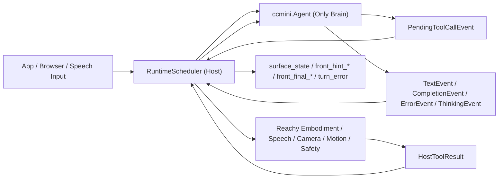

# ccmini 作为 Reachy Mini 唯一大脑的接入设计

## 1. 背景

当前 Reachy Mini resident runtime 的官方文档定义是双层脑结构，见 [AI Integrations](integration.md)：

`app project -> front -> BrainKernel -> front`

这代表当前运行时里同时存在两套认知层：

- `front`
- `core / BrainKernel`

其中：

- `front` 负责前台表达、快速前台响应、前台动作决策、用户可见话术
- `core / BrainKernel` 负责任务推理、工具调用、记忆、路由、后台 run

与此同时，`ccmini` 的文档已经把它定义成统一大脑和可嵌入 brain SDK，见：

- `src/ccmini/README_ZH.md`
- `src/ccmini/CCMINI_EMBEDDABLE_BRAIN_SDK_ZH.md`
- `src/ccmini/CCMINI_ROBOT_TOOL_INTEGRATION_ZH.md`
- `src/ccmini/CCMINI_PROFILES_ZH.md`

这两条线目前并存，但没有合成一条真正统一的运行时主链。

## 2. 目标

本文的目标是定义一条清晰的迁移方向：

- 只保留一个大脑
- 这个大脑是 `ccmini.Agent`
- `front` 和 `core` 不再作为独立脑层存在
- Reachy Mini 保留宿主、执行、UI、表情、语音、安全、实时控制职责
- 第一阶段只替换内部主链，不改变外部接口和用户使用方式

实现层的状态机草图见：

- [RuntimeScheduler 单脑状态机草图](ccmini-single-brain-runtime-state-machine.md)

### 2.1 建议阅读顺序

为了减少在三份文档之间反复跳读，建议按下面顺序阅读：

1. 先读本文，理解单脑方向、分层、边界和阶段目标
2. 再读 [RuntimeScheduler 单脑状态机草图](ccmini-single-brain-runtime-state-machine.md)，理解 turn / run / stale / 打断规则
3. 最后读 [ccmini 单脑架构实施清单](ccmini-single-brain-checklist.md)，把它转成实际改造任务和验证项

### 2.2 术语表

下面这些术语建议在整套文档里固定含义，不再混用。

- `thread_id`
  外部 UI / 浏览器线程标识。它是宿主和浏览器共同理解的前台会话概念。
- `conversation_id`
  `ccmini` 内部会话标识。第一阶段建议与 `thread_id` 维持稳定一对一映射，但语义上它属于 brain 会话，不属于浏览器协议。
- `session_id`
  app/runtime 或连接层的上下文标识。它不等于 `conversation_id`，也不应该默认等于一个用户 turn。
- `turn_id`
  一次用户输入对应的一轮主链标识，由 `agent.submit_user_input(...)` 返回，并贯穿该轮对用户可见的输出。
- `run_id`
  一次 query 执行片段或 tool 恢复续跑链路的标识。一个 `turn_id` 可以关联一个或多个 `run_id`。
- `tool_use_id`
  单个工具调用的唯一标识。它用于把 `PendingToolCallEvent.calls[*]` 和后续 `HostToolResult` 对上。
- `stale`
  旧 turn 已失去前台可见资格，但内部清理、停止动作、释放资源仍可继续。
- `surface_state`
  宿主发给浏览器的生命周期 / 表情 / UI 相位状态，不等于 brain 的内部推理事件。
- `front_hint_*`
  宿主本地即时提示事件。单脑架构下它是可选增强，不再承载真实 assistant 主回复流。
- `front_final_*`
  单脑架构下真正面向用户的 assistant 回复流。默认由 `TextEvent` 和 `CompletionEvent` 映射而来。

## 3. 非目标

本文明确不追求下面这些事情：

- 不在第一阶段重写浏览器前端
- 不在第一阶段改 WebSocket 协议
- 不在第一阶段改 app project 目录结构
- 不在第一阶段马上物理删除 `front/` 和 `core/`
- 不在第一阶段启用全部 `ccmini` 高级能力，如 Kairos、多 agent、Buddy 驱动 UI
- 不把机器人高频控制环塞进 `ccmini`

## 4. 核心结论

Reachy Mini 后续应采用如下结构：

一句话总结：

- `ccmini` 负责思考
- Reachy Mini 宿主负责执行和表现
- 外部看到的协议先不变
- 内部不再保留双脑

## 5. 当前架构的主要问题

当前 `front -> BrainKernel -> front` 的双层脑结构虽然能工作，但会带来这些问题：

- 职责重叠：`front` 和 `core` 都在做认知相关判断
- 状态分裂：前台知道一部分上下文，核心知道另一部分上下文
- 记忆分裂：`front` 和 `kernel` 的行为、历史、提示词边界不统一
- 输出路径复杂：前台先说一遍，核心再想一遍，最后前台再包装一遍
- 配置双份：`front_model` 和 `kernel_model` 同时存在，复杂度高
- 迁移成本上升：想增强大脑能力时，要同时考虑两层模型链路

对于只保留一个大脑的方向，这套结构应逐步退出主链。

## 6. 为什么选 ccmini 做唯一大脑

`ccmini` 已经具备统一大脑所需的关键能力，不只是一个模型调用封装。

它已经提供：

- 常驻生命周期：`start()` / `stop()`
- 正式宿主入口：`submit_user_input(...)`
- 正式事件输出：`on_event(...)`、`wait_event()`、`poll_event()`、`drain_events()`
- 工具暂停恢复：`PendingToolCallEvent` + `submit_tool_results(...)`
- 宿主事件注入：`publish_host_event(HostEvent(...))`
- `Tool` / `ClientTool` 边界
- Hook 体系：`PreQueryHook`、`PreToolUseHook`、`IdleHook`、`StopHook` 等
- 统一 memory/session
- 流式事件：`TextEvent`、`CompletionEvent`、`ThinkingEvent`、`ToolProgressEvent`、`ErrorEvent`
- 快响应相关能力：fast mode、prompt suggestion、speculation、tool-use summary
- 后台任务、多 agent、Kairos、Buddy 等进一步扩展能力

这说明 `ccmini` 不是再加一层，而是已经具备取代当前双脑的基础。

## 7. 新分层定义

未来建议固定为四层。

### 7.1 认知层：ccmini

职责：

- 理解用户输入
- 决定回复内容
- 决定是否调用工具
- 决定调用哪个工具
- 组织多步推理
- 维护会话与记忆
- 发出流式事件

边界：

- 不直接持有高频电机控制
- 不直接做原始传感器实时处理
- 不直接绑定浏览器协议

### 7.2 宿主编排层：RuntimeScheduler

职责：

- 接收用户文字与语音事件
- 调用 `ccmini` 的正式宿主接口
- 监听 `ccmini` 流式事件
- 执行工具调用
- 提交工具结果
- 生成和推送外部协议消息
- 控制语音播放、表情中断、surface 状态

边界：

- 不再自己做推理
- 不再持有第二颗脑
- 不再依赖 `FrontService` / `BrainKernel` 作为主链

### 7.3 执行层：Embodiment

职责：

- 电机执行
- 动作管理
- 表情管理
- TTS/音频播放
- 摄像头采集
- 视觉处理
- 头部跟踪
- 安全限制和执行前保护

边界：

- 不负责决策
- 不负责语言生成
- 不负责会话记忆

### 7.4 外部接口层：App / Browser

职责：

- WebSocket 消息收发
- 浏览器 UI
- 麦克风输入
- 外部调用入口

边界：

- 不直接知道 `ccmini` 内部协议
- 不与内部 brain 深耦合

## 8. front 和 core 未来如何处理

这里最重要的是，不要把停用脑职责和物理删目录混为一谈。

### 8.1 front 的处理

未来应停止把 `front` 当成模型层使用。

`front` 当前承担了两类职责：

- 认知职责：快速前台回复、前台动作决策、前台话术生成
- 表现职责：listening、replying、idle 等 UI/表情节奏

未来处理方式：

- 认知职责并入 `ccmini`
- 表现职责下沉到宿主本地规则
- `FRONT.md` 保留，作为统一 prompt 的风格输入
- `FrontService` 不再走主推理链

### 8.2 core 的处理

未来应停止把 `BrainKernel` 当成主脑使用。

`core` 当前承担了：

- resident loop
- task routing
- tool loop
- run state
- memory
- sleep consolidation

未来处理方式：

- resident brain 改由 `ccmini.Agent`
- task/tool/memory 主链改由 `ccmini`
- run/event/tool-result 协议统一改为 `ccmini` 宿主接口
- `BrainKernel` 不再是热路径
- `core.memory` 不迁移、不复用，统一 memory/session 直接收口到 `ccmini`
- `core.sleep_agent` 不迁移；如果未来需要空闲维护能力，应基于 `Hook` 或 background task 重新设计，而不是继承旧实现
- `core.run_store` 不迁移、不保留为宿主任务板；宿主只保留最小必要的线程态和执行态
- 不应把 `BrainKernel` 逻辑一比一搬进 `ccmini`

## 9. 为什么仍然需要宿主本地规则

只保留一个大脑不等于一切都交给大脑。

宿主本地规则不是第二颗脑，而是反射层、执行层和协议层。

应该保留在宿主本地的东西包括：

- `listening / listening_wait / replying / settling / idle` 这类 UI 生命周期
- 用户一开口立即打断播放
- 正在收音时切换 surface 状态
- 语音播放结束后的回落节奏
- 高实时性和高频控制
- 运动执行前最后一层安全检查
- WebSocket 外部协议消息格式

这些事情的特点是：

- 低延迟
- 强确定性
- 强硬件耦合
- 强安全约束
- 不需要思考
- 不应该依赖模型输出才能完成

所以宿主本地规则必须保留，但它们不构成第二颗脑。

## 10. ccmini 在快响应方面可以替代 front 什么能力

旧 `front` 存在的一大理由是快速响应用户，但 `ccmini` 已经有足够强的快响应能力。

可利用的能力包括：

- 非阻塞提交：`submit(...)` / `submit_user_input(...)`
- 流式输出：`TextEvent`
- 思考状态：`ThinkingEvent`
- 工具进度：`ToolProgressEvent`
- 工具摘要：`ToolUseSummaryEvent`
- fast mode
- prompt suggestion
- speculation

这意味着未来快速响应不再需要一个单独 front-model 层。

未来替代方式：

- 默认把 `TextEvent` 作为实际回复流，转换成旧的 `front_final_chunk`
- `CompletionEvent` 作为整轮最终全文，转换成 `front_final_done`
- `front_hint_*` 仅保留给宿主本地即时确认、fast mode 或后续 speculation；第一阶段允许完全不发
- `ThinkingEvent` 和 `ToolProgressEvent` 驱动中间状态、surface 过渡态或可选的短暂提示
- speculation 和 fast mode 作为后续增强能力

## 11. 新的主边界：Tool + Hook + HostEvent + HostToolResult

这是最关键的统一边界。

### 11.1 Tool

作用：

- 告诉大脑你有哪些能力可以调用

推荐暴露给 `ccmini` 的最小工具集合：

- `speak`
- `move_head`
- `look_at`
- `play_emotion`
- `dance`
- `head_tracking`
- `camera`
- `stop_motion`
- `wake_up`
- `goto_sleep`

可选：

- `set_interaction_mode`
- `notify_user`
- `get_robot_capabilities`
- `record_memory_marker`

不要暴露：

- 原始关节写入
- 高频 `set_target()` 连续接口
- 原始 PID / 扭矩参数写入
- 原始传感器流透传

工具契约建议：

- 一次性工具：`speak`、`move_head`、`look_at`、`play_emotion`、`camera`
- 模式切换工具：`wake_up`、`goto_sleep`、`set_interaction_mode`
- 长时且可中断工具：`dance`、`head_tracking`
- 中断工具：`stop_motion`，用于停止长时动作、跟踪或当前排队中的运动

这些工具的边界应明确为：

- `ccmini` 只决定“要不要调工具”和“用什么参数调”
- 宿主负责工具互斥、排队、取消、安全裁决和硬件资源占用
- 长时工具不应把高频控制环阻塞在模型推理里
- 长时工具应先返回 `queued` / `started`，必要时再通过后续结果或宿主状态变化体现 `completed` / `stopped`
- `stop_motion` 应设计为幂等操作，避免重复调用导致额外副作用

### 11.2 Hook

作用：

- 给大脑提供安全和上下文环境，不是主业务入口

优先使用的 Hook：

- `PreQueryHook`
- `PreToolUseHook`
- `IdleHook`
- `SessionStartHook`
- `SessionEndHook`
- `StopHook`
- `NotificationHook`

### 11.3 HostEvent

作用：

- 宿主将状态和系统事件注入会话

适合注入：

- `sensor_summary`
- `speech_started`
- `speech_stopped`
- `mode_changed`
- `surface_summary`
- `vision_attention_summary`
- `safety_state`

不适合注入：

- 高频原始流
- 每帧图像
- 低层日志

### 11.4 HostToolResult

作用：

- 宿主在执行完 client-side tool 后，把结果结构化回给 `ccmini`

适合返回：

- 已排队
- 已开始
- 已完成
- 已拒绝
- 简短视觉结果
- 动作执行摘要
- 错误信息

## 12. 外部不变，内部替换

第一阶段应坚持一个原则：

- 外部行为不变
- 内部主链替换

外部保持不变的内容：

- app project 结构
- `FRONT.md / AGENTS.md / USER.md / SOUL.md / TOOLS.md`
- `GET /`
- `WS /ws/agent`
- 浏览器消息结构
- `front_hint_*`
- `surface_state`
- `front_final_*`
- `turn_error`

内部替换的内容：

- `FrontService` 推理主链
- `BrainKernel` 推理主链
- `BrainEvent / BrainOutput` 主协议
- `front_model` 和 `kernel_model` 双脑行为

## 13. 接口映射关系

旧接口到新接口可以这样映射：

- `BrainKernel.publish_user_input(...)`
  -> `ccmini.Agent.submit_user_input(...)`
- `BrainKernel.publish_observation(...)`
  -> `ccmini.Agent.publish_host_event(...)`
- `BrainKernel.publish_front_event(...)`
  -> `ccmini.Agent.publish_host_event(...)`
- `BrainKernel.publish_tool_results(...)`
  -> `ccmini.Agent.submit_tool_results(...)`
- `BrainKernel.recv_output()`
  -> `ccmini.Agent.on_event(...)` / `wait_event()` / `drain_events()`

旧数据结构到新数据结构：

- `PendingToolCall.tool_call_id`
  -> `ToolCallEvent.tool_use_id`
- `PendingToolCall.args`
  -> `ToolCallEvent.tool_input`
- `ToolResult.success`
  -> `HostToolResult.is_error = not success`
- `FrontEvent`
  -> `HostEvent`
- `BrainOutput.response.reply`
  -> `CompletionEvent.text`

### 13.1 常驻 runtime 的推荐调用方式

对 Reachy Mini 这种常驻 runtime，推荐主路径固定为：

- 入口用 `submit_user_input(...)`
- 输出消费用 `on_event(...)` 或 `wait_event()` / `drain_events()`
- client-side tool 恢复用 `submit_tool_results(...)`

`query()` 仍然有价值，但更适合：

- 单次脚本
- bridge / demo host
- 调试或测试

不建议让 `RuntimeScheduler` 的常驻主循环直接围绕 `query()` 组织。

### 13.2 宿主最小状态模型

既然不再保留 `core.memory`、`run_store`、`sleep_agent`，宿主侧应只维护最小必要状态。

更完整的 turn / run / stale / 打断规则，见：

- [RuntimeScheduler 单脑状态机草图](ccmini-single-brain-runtime-state-machine.md)

建议固定保留：

- `thread_id -> conversation_id`
  外部线程和 `ccmini` 会话的一对一稳定映射
- `thread_id -> current_turn_id`
  当前对浏览器仍然有效的活跃回合
- `run_id -> {thread_id, conversation_id, turn_id}`
  用于 `PendingToolCallEvent` 恢复时精确路由 `submit_tool_results(...)`
- `thread_id -> surface_state`
  当前 surface / phase 的宿主态
- `thread_id -> audio_state`
  例如收音中、播放中、冷却中
- `thread_id -> execution_handles`
  例如当前动作、跟踪、TTS 播放等可中断句柄

建议固定遵守的规则：

- `thread_id` 是外部 UI / 浏览器概念，`conversation_id` 是 `ccmini` 会话概念；第一阶段保持稳定一对一
- 同一 `thread_id` 上出现新的用户输入后，旧 `turn_id` 的前台输出应视为过期，不再继续推送给浏览器
- 过期事件可以继续用于本地清理，但不能污染新的前台 turn
- `submit_tool_results(run_id, ...)` 必须按保存下来的 `run_id` 映射恢复，不能猜测“当前线程就是目标线程”
- 宿主不重新长出任务板、双轨 memory 或 sleep 子系统

### 13.3 浏览器事件翻译建议

第一阶段保持旧 WebSocket 协议时，建议明确使用下面这张翻译表。

| ccmini 事件 / 宿主信号 | 旧浏览器事件 | 建议 |
| --- | --- | --- |
| `TextEvent` | `front_final_chunk` | 作为实际 assistant 流式输出追加到最终回复 |
| `CompletionEvent` | `front_final_done` | 发送整轮最终全文，作为前台收口结果 |
| 宿主本地即时确认 / fast mode / speculation | `front_hint_chunk` / `front_hint_done` | 可选；第一阶段允许完全不发 |
| `ThinkingEvent` | 无强制公开事件 | 默认仅驱动 `surface_state` 或宿主本地中间态 |
| `ToolProgressEvent` | 无强制公开事件 | 默认宿主内部消化；如确有必要，可翻成短暂 hint 或 system text |
| `PendingToolCallEvent` | 不直接透传 | 宿主执行工具后走 `submit_tool_results(...)` 恢复 |
| `ErrorEvent` | `turn_error` | 绑定当前 `turn_id`，直接暴露给浏览器 |
| 宿主生命周期状态变化 | `surface_state` | 继续沿用现有协议 |

额外约束：

- 如果已经发过 `front_final_chunk`，则 `front_final_done` 应携带该轮最终全文，前端以 done 为准收口
- 不要把真实回复流伪装成 `front_hint_*`，否则会重新引入“hint/final 双轨语义不清”的问题
- 浏览器允许完全收不到 `front_hint_*`，不能把 hint 当成单脑主链的必需事件

## 14. Prompt 资产怎么利用

统一大脑后，prompt 资产不能浪费，反而应该更集中利用。

建议统一 system prompt 组成：

- `AGENTS.md`
- `USER.md`
- `SOUL.md`
- `TOOLS.md`
- `FRONT.md`
- 宿主追加上下文

这里最关键的一点是：

- `FRONT.md` 继续保留
- 但它不再意味着必须有一个 front model
- 它只是统一 brain 的一部分风格输入

## 15. 该怎么利用 ccmini 的强大能力

这里不是简单替换，而是要真正用到 `ccmini` 的优势。

优先值得利用的能力：

- 常驻单 Agent
- 流式输出
- client-tool 暂停恢复
- Hook 体系
- 统一 memory/session
- fast mode
- tool-use summary
- prompt suggestion
- speculation

第二阶段后可考虑利用的能力：

- background tasks
- coordinator mode
- team / peer
- Kairos
- Buddy

建议顺序：

- 第一阶段只用核心宿主接口，不上复杂特性
- 第二阶段再启用少量高价值增强
- 第三阶段再评估自治与多 agent 能力

## 16. 推荐迁移阶段

### 阶段一：内部接入 ccmini，但外部完全不变

目标：

- `RuntimeScheduler` 内部持有 `ccmini.Agent`
- 现有 Reachy 执行器继续工作
- 浏览器协议完全不变
- 旧 `front/core` 可以暂时留在代码目录中，但不再参与主推理热路径

动作：

- 新增 `ccmini` host adapter
- 用户输入改走 `submit_user_input(...)`
- 工具恢复改走 `submit_tool_results(...)`
- 状态注入改走 `HostEvent`
- 流式事件翻译成旧 WebSocket 输出

### 阶段二：清理旧 core 兼容链

目标：

- 旧 `core` 不再被 runtime 或兼容层继续引用
- 删除对旧 `core` 协议和状态模型的剩余依赖

动作：

- 停止使用 `publish_user_input / recv_output / publish_tool_results`
- 停止使用 `BrainEvent / BrainOutput` 作为运行时主协议

### 阶段三：清理旧 front 兼容链

目标：

- 不再保留 front-model LLM 依赖
- 仅保留风格资产与宿主表现逻辑

动作：

- 停止使用 `FrontService.handle_user_turn(...)`
- 停止使用 `FrontService.present(...)`
- 停止依赖 `front_model`

### 阶段四：配置收口

目标：

- 从双模型收口成单脑模型配置

动作：

- 移除 `front_model`
- 移除 `kernel_model`

补充说明：

- 第一阶段完成后，旧 `front/core` 就应退出主推理热路径
- 第二、三阶段主要是去兼容、去遗留、去双轨概念，而不是再次切一遍主链
- 收敛成统一 brain provider/model 配置

### 阶段五：清理和删除

目标：

- 物理删除不再需要的旧脑层模块

动作：

- 删除 `front/` 脑层代码
- 删除 `core/` 脑层代码
- 保留必要兼容 shim 仅在确实需要时存在

## 17. 第一阶段最稳的实现目标

第一阶段的成功定义应该是：

- 浏览器完全无感知
- 用户还是走现在这套 app project
- 现有工具执行器不重写
- 现有 UI 事件名不变
- 机器人行为不退化
- 内部主链已经换成 `ccmini`

如果这一步跑通，后面删 front/core 就只是清理问题，不再是架构风险。

## 18. 明确不该做的事

- 不要为了保留前台润色而偷偷保留一个 front model
- 不要一边说只要一个大脑，一边继续维护两套 memory/runtime 协议
- 不要把高频运动控制放进 `ccmini`
- 不要让 `ccmini` 直接知道浏览器消息格式
- 不要第一阶段同时重写前端和大脑
- 不要把旧 `BrainKernel` 的概念硬搬一遍进 `ccmini`

## 19. 一句话总结

Reachy Mini 若要真正实现一个大脑，最正确的方向不是继续修补 `front + core` 双脑，而是：

- 让 `ccmini` 成为唯一认知层
- 让 Reachy Mini 保持宿主、执行、表现、安全职责
- 通过 `Tool + Hook + HostEvent + HostToolResult` 完成接入
- 第一阶段只换内部，不动外部
