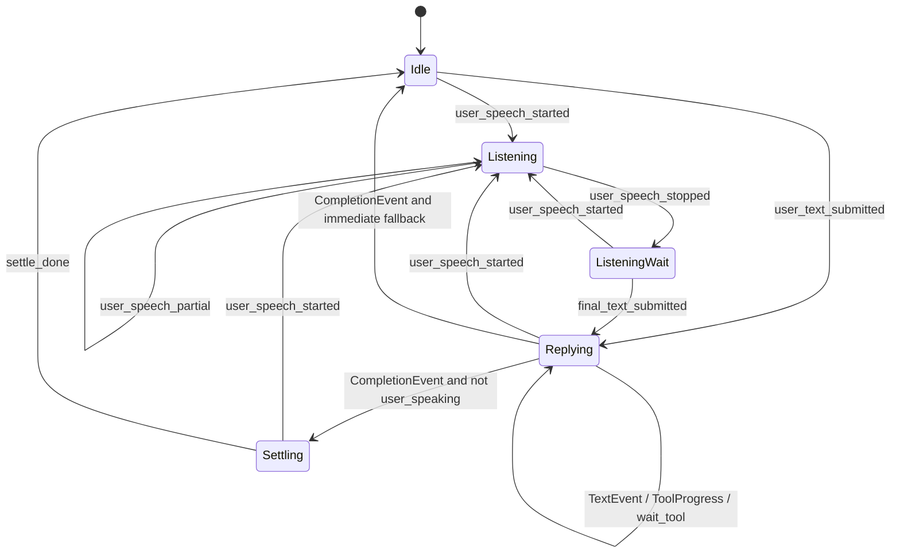
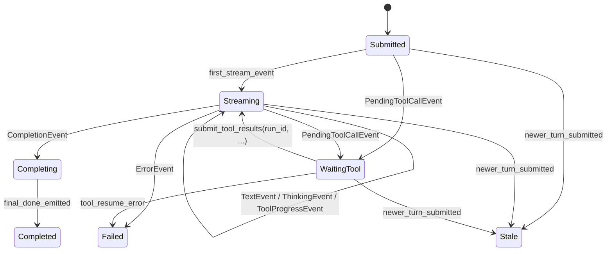

# RuntimeScheduler 单脑状态机草图

本文是 `ccmini` 单脑架构的实现草图，目标是把 `RuntimeScheduler` 在单脑模式下必须维护的最小状态、相位流转和事件处理规则写清楚。

它服务于下面两份文档：

- [ccmini 单脑架构设计](ccmini-single-brain-design.md)
- [ccmini 单脑架构实施清单](ccmini-single-brain-checklist.md)

重点不是补充新的架构方向，而是把当前 `RuntimeScheduler` 单脑模式下的状态约束写清楚，方便继续维护和增强。

术语定义默认沿用 [ccmini 单脑架构设计](ccmini-single-brain-design.md) 里的术语表，尤其是：

- `thread_id`
- `conversation_id`
- `session_id`
- `turn_id`
- `run_id`
- `tool_use_id`
- `stale`

## 1. 目标

这份状态机草图只解决四件事：

- 明确宿主到底保留哪些最小状态
- 明确线程相位如何流转
- 明确 turn / run / tool 恢复怎么关联
- 明确用户打断、stale 输出和浏览器单轨协议怎么处理

它不做这些事：

- 不重新引入 `run_store`
- 不重新引入 `core.memory`
- 不复活 `sleep_agent`
- 不把高频控制环交给 `ccmini`
- 不要求浏览器直接消费全部 `ccmini` 原生事件对象

## 2. 为什么需要显式状态机

双脑时代，很多“到底现在是谁在说话、谁还活着、哪个输出该显示”的问题，被散落在：

- `front`
- `core`
- runtime 局部状态
- 浏览器前台逻辑

单脑之后，这些歧义不能继续靠隐式耦合维持。

如果不把状态机写清楚，就会很容易出现：

- 新 turn 提交后，旧 turn 的流式文本还在往前台冒
- `PendingToolCallEvent` 恢复到了错误线程
- 用户已经重新开口，reply audio 还在播
- `text_delta`、`thinking`、`tool_progress` 和 `turn_done` 的职责再次混淆

所以 `RuntimeScheduler` 必须成为唯一的宿主状态裁决点。

这里的“唯一裁决点”需要明确成：

- 它统一负责前台可见性的裁决
- 但裁决范围是 **per-thread lane**
- 不是“全局只有一个前台活跃 turn”

换句话说：

- A 线程来了新输入，只会让 A 的旧 turn stale
- B 线程的前台 lane 不受影响
- 后台任务、worker、Kairos、memory 等常驻能力也不应因此停止

## 3. 设计原则

- 一个 `thread_id` 在任意时刻只允许有一个“该线程自己的前台可见当前 turn”
- 不同 `thread_id` 的前台 lane 彼此独立，不做全局前台串行化
- `ccmini` 负责认知和工具决策，宿主负责相位、打断、互斥、安全和协议翻译
- `run_id` 永远从属于某个确定的 `turn_id`
- 旧事件可以继续跑完内部清理，但不能污染新的前台 turn
- 单轨协议清晰度优先于旧浏览器兼容，内部复杂性先在宿主消化
- 后台任务、worker、Kairos、memory 等能力属于 runtime-level 常驻态，不因某个前台 lane 切换而自动停止

## 4. 宿主最小状态

不引入新的大状态仓库，只保留最小必要映射。

### 4.1 ThreadState

建议每个 `thread_id` 维护：

```text
conversation_id: str
current_turn_id: str
current_phase: idle | listening | listening_wait | replying | settling
user_speaking: bool
reply_audio_state: idle | playing | interrupt_pending | interrupted | cooldown
surface_state: dict
last_user_text: str
active_run_ids: set[str]
execution_handles: {
  motion?,
  tracking?,
  tts?,
}
```

解释：

- `conversation_id` 是 `ccmini` 会话 id，第一阶段与 `thread_id` 保持稳定一对一
- `current_turn_id` 是浏览器前台的唯一裁决依据
- `current_phase` 只表示宿主生命周期相位，不表示模型内部推理细节
- `active_run_ids` 用于 client-side tool 恢复
- `execution_handles` 只保存可中断执行句柄，不是任务板

### 4.2 TurnState

建议每个 `turn_id` 维护：

```text
thread_id: str
conversation_id: str
status: submitted | streaming | waiting_tool | completing | completed | failed | stale
user_text: str
final_text_buffer: str
run_ids: set[str]
created_at: float
```

解释：

- `final_text_buffer` 用于收集 `TextEvent`
- `status=stale` 代表该 turn 仍可能有内部事件返回，但已经失去前台显示资格
- 一个 turn 允许关联多个 `run_id`，尤其是工具恢复后的续跑阶段

### 4.3 RunState

建议每个 `run_id` 维护：

```text
thread_id: str
conversation_id: str
turn_id: str
status: running | waiting_tool | resumed | finished | failed | stale
tool_calls: list[tool_use_id]
```

解释：

- `run_id` 是 tool 恢复时唯一可信的路由键
- 不允许通过“当前线程看起来像这个线程”去猜归属

补充说明：

- 这里描述的是宿主目标态状态模型
- 如果当前 `ccmini` 实现仍是单 pending-client-run continuation 槽位，第一阶段宿主应按该现状适配
- 宿主可以先维护 `run_id -> {thread_id, conversation_id, turn_id}` 映射接口，但不要误以为底层已天然支持一个 turn 上多个并发 client-side continuation
- 这里的 turn / run 状态机是 **per-thread lane** 的，不是全局唯一 turn 状态机

## 5. 核心不变量

实现时建议把下面几条当成硬约束：

- 同一 `thread_id` 上，只有 `current_turn_id` 对应的输出可以继续推送浏览器
- 任意 `TextEvent` / `CompletionEvent` / `ErrorEvent` 都必须先比对 `turn_id`
- `PendingToolCallEvent` 只能通过其自带 `run_id` 恢复
- `user_speech_started` 可以抢占 reply audio，但不应该直接把模型内推理状态伪装成“被宿主成功取消”
- `text_delta` 是唯一主回复流，不再并行维护 hint/final 双轨
- reply audio 被打断后，允许本轮逻辑完成内部清理，但不应再强行进入可见的 settle 动画链

## 6. 两层状态机

建议把状态分成两层理解：

- 线程生命周期相位
- turn / run 内部执行子状态

不要把它们混成一个大枚举。

### 6.1 线程生命周期相位



对应语义：

- `Idle`: 没有活跃 turn，允许 idle tick
- `Listening`: 用户正在说话，宿主立即切听状态，并准备打断播放
- `ListeningWait`: 用户刚停止说话，等待最终文本或下一次开口
- `Replying`: 已提交给 `ccmini`，正在流式输出、等工具、或播报回复
- `Settling`: 最终回复结束后的短暂回落相位，可选

### 6.2 Turn / Run 子状态



关键点：

- `stale` 不是错误，而是“已经失去前台显示资格”
- turn 进入 `stale` 后，允许继续内部清理、释放资源、更新统计
- 但不允许再向浏览器发 `text_delta / turn_done / turn_error` 或覆盖 `surface_state`

## 7. 关键事件处理规则

### 7.1 `user_speech_started`

宿主动作：

- `user_speaking = true`
- 相位切到 `listening`
- 取消 idle tick
- 如果 reply audio 正在播放，启动带 grace 的 interrupt
- 立即推 `surface_state(listening)`

不做的事：

- 不直接提交 `ccmini`
- 不创建新 turn
- 不猜测上一个 turn 是否“真正取消”

### 7.2 `user_speech_partial`

宿主动作：

- 保持 `listening`
- 更新 `last_user_text`
- 可继续发 `speech_preview`

不做的事：

- 不提交 `ccmini`
- 不生成新的 `turn_id`

### 7.3 `user_speech_stopped`

宿主动作：

- `user_speaking = false`
- 相位切到 `listening_wait`
- 如果当前没有活跃 turn，可恢复 idle tick 计时
- 推 `surface_state(listening_wait)`

### 7.4 `user_text_submitted`

来源可以是：

- 文本输入框直接提交
- 语音转写最终文本

宿主动作：

1. 为该线程拿到稳定 `conversation_id`
2. 把旧 `current_turn_id` 对应 turn 标记为 `stale`
3. 调用 `agent.submit_user_input(...)`
4. 保存返回的 `turn_id`
5. 建立新的 `TurnState`
6. 更新 `current_turn_id = turn_id`
7. 相位切到 `replying`
8. 推 `surface_state(replying)`

这里最关键的是：

- “新 turn 开始”靠 `submit_user_input(...)` 返回的 `turn_id` 确认
- 不是靠浏览器本地猜一个 turn id
- 某个线程建立新 turn 后，只会让该线程自己的旧 turn stale

### 7.5 `TextEvent`

宿主动作：

- 先校验 `event.turn_id == current_turn_id`
- 如果不相等，按 stale 事件处理，不再推浏览器
- 如果相等，把 `text` append 到 `TurnState.final_text_buffer`
- 发 `text_delta`

默认不做的事：

- 不再额外并行发一条 hint 文本流

### 7.6 `PendingToolCallEvent`

宿主动作：

- 把 `run_id -> {thread_id, conversation_id, turn_id}` 记入映射
- turn 状态改成 `waiting_tool`
- 将 `calls[*].tool_use_id` 也记入当前 run
- 不直接把该事件透传浏览器
- 调用宿主工具执行器

如果工具是长时工具：

- 可先返回 `queued` / `started`
- 工具继续运行时，由宿主维持执行句柄和安全状态

### 7.7 `submit_tool_results(run_id, ...)`

宿主动作：

- 必须用保存下来的 `run_id` 路由
- 恢复前再次检查该 `run_id` 对应的 turn 是否已 stale
- 即使 stale，也允许把恢复链跑完用于资源清理
- 但 follow-up 输出默认不再继续推浏览器

### 7.8 `CompletionEvent`

宿主动作：

- 校验 `turn_id`
- 如果是 stale turn，内部完成清理后丢弃浏览器输出
- 如果是当前 turn：
  - 发 `turn_done`
  - 把最终全文作为前台收口结果
  - 若 `user_speaking == false` 且未被 reply audio interrupt，则进入 `settling`
  - 否则直接跳过可见 settle，等待后续语音链或回到 idle

### 7.9 `ErrorEvent`

宿主动作：

- 校验 `turn_id`
- 若为当前 turn，发 `turn_error`
- turn 状态改为 `failed`
- 如果用户此时没在说话，可直接切 `idle` 或短暂 `settling -> idle`

### 7.10 `idle_tick`

触发条件：

- `current_phase == idle`
- 该线程没有活跃 turn

宿主动作：

- 可以做 idle 动作、表情或低频维护
- 但不应该重新长出 `sleep_agent` 式自治子系统

### 7.11 coordinator worker / task notification

如果主脑运行在 `coordinator` 模式，后台 worker 完成、失败、被停止时，宿主或 runtime 可能会收到 task notification / runtime notification。

建议规则：

- 这些通知属于主脑内部协作事件，不代表出现了第二颗脑
- 它们可以进入 `ccmini` 当前会话，作为后续综合、继续派工或总结的输入
- 它们本身不自动生成新的前台 `turn_id`
- 它们本身也不应直接覆盖当前 `text_delta / turn_done`
- 如果主脑基于这些通知决定继续对用户说话，仍然要通过当前 turn 规则或一个新的正式 turn 来输出

一句话：

- worker 可以后台跑
- 但前台输出裁决仍然只认宿主当前 turn 规则
- 某个线程 stale 不应被解释成后台 worker / Kairos / memory 任务要一起停止

## 8. stale 事件处理策略

这是单脑状态机里最容易被漏掉的地方。

建议统一规则如下：

- 新 turn 一旦建立，前一个 `current_turn_id` 立即变 stale
- stale turn 的 `TextEvent`、`CompletionEvent`、`ErrorEvent` 默认都不再推浏览器
- stale run 的工具恢复仍可继续，仅用于：
  - 释放资源
  - 停止运动
  - 完成必须的宿主清理
- stale turn 允许写本地 debug log，但不允许覆盖当前 surface

一句话概括：

- stale 不是“强制杀死”
- stale 是“失去前台可见资格”
- stale 也是 **线程内语义**，不是“全局所有线程一起作废”

## 9. reply audio 与打断

建议把 reply audio 当成宿主局部子状态，而不是 turn 主状态。

推荐子状态：

```text
idle -> playing -> interrupt_pending -> interrupted -> cooldown -> idle
```

规则：

- `user_speech_started` 时，如果正在 `playing`，转到 `interrupt_pending`
- grace 到期仍在说话，则真正执行 interrupt，转到 `interrupted`
- `interrupted` 不等于 turn 取消，只表示宿主停止播报
- 如果 turn 后续还有 `CompletionEvent`，只做内部收口，不再强行要求可见 settle
- cooldown 只解决音频设备或 UX 节奏，不参与 brain 路由

## 10. 长时工具与中断

建议把工具分成三类：

- 一次性工具：很快返回结果
- 模式切换工具：改变宿主模式但不持续占据推理链
- 长时工具：持续运行，必须有显式停止路径

第一阶段建议的处理规则：

- `dance`、`head_tracking` 视为长时工具
- 长时工具启动后，执行句柄进入 `execution_handles`
- 用户新开口时，不强制立即停所有长时工具
- 但宿主应有明确策略，至少能通过 `stop_motion` 做幂等停止
- `stop_motion` 应作用于：
  - 当前动作
  - 当前 tracking
  - 当前运动队列

如果某个长时工具必须和 reply audio 或 listening 互斥，也应由宿主裁决，不由 `ccmini` 推理层决定。

## 11. 浏览器输出规则

第一阶段建议固定如下：

- 宿主 ASR / partial transcript -> `speech_preview`
- `TextEvent` -> `text_delta`
- `CompletionEvent` -> `turn_done`
- `ErrorEvent` -> `turn_error`
- 相位变化 -> `surface_state`
- `ThinkingEvent` -> `thinking`
- `ToolProgressEvent` -> `tool_progress`

前端要求：

- `speech_preview` 仍然可用
- `text_delta` 是唯一 assistant 文本流
- `turn_done` 到来时，以其全文为准收口
- 对于 stale turn，前端不应该再收到新的 `text_delta / turn_done / turn_error`
- coordinator 的后台 worker 通知不应直接伪装成新的 assistant 回复事件

## 12. 一条完整 happy path

下面用一个具体例子，把“语音输入 -> 工具调用 -> 流式回复 -> 最终收口”完整走一遍。

约定：

- `thread_id = "thread-demo"`
- `conversation_id = "thread-demo"`
- `turn_id = "turn_a1b2c3"`
- `run_id = "run_r1"`
- `tool_use_id = "toolu_cam_1"`

用户目标：

- 用户对机器人说：“看看我前面是谁。”

推荐时序：

1. 浏览器或本地麦克风桥发出 `user_speech_started`。
   宿主切到 `listening`，并在需要时准备打断 reply audio。
2. 用户说话过程中，宿主可接收若干 `user_speech_partial`。
   这些 partial 只更新 `speech_preview` 或本地缓存，不创建 turn。
3. 语音结束后，宿主收到 `user_speech_stopped`。
   宿主切到 `listening_wait`，等待 ASR 最终文本。
4. ASR 产出最终文本“看看我前面是谁”。
   宿主将旧 `current_turn_id` 标记为 stale，然后调用 `agent.submit_user_input(...)`，拿到新的 `turn_id = "turn_a1b2c3"`，线程相位切到 `replying`。
5. `ccmini` 先发出若干 `ThinkingEvent`。
   宿主可只更新 `surface_state(replying)`，默认不把 thinking 直接透传浏览器。
6. `ccmini` 发现需要看相机，于是发出 `PendingToolCallEvent(run_id="run_r1")`，其中包含：
   - `tool_name = "camera"`
   - `tool_use_id = "toolu_cam_1"`
7. 宿主记录 `run_id -> {thread_id, conversation_id, turn_id}`，执行相机工具，并构造 `HostToolResult(tool_use_id="toolu_cam_1", ...)`。
8. 宿主调用 `agent.submit_tool_results("run_r1", [...])` 恢复该轮。
9. 恢复后的续跑流里，`ccmini` 发出：
   - `TextEvent("我看到")`
   - `TextEvent("你前面站着一个人。")`
   宿主把它们依次映射成 `text_delta`。
10. `ccmini` 发出 `CompletionEvent(text="我看到你前面站着一个人。")`。
    宿主发 `turn_done`，以全文收口。
11. 如果此时用户没有重新开口，且 reply audio 没被打断，宿主进入短暂 `settling`，随后回到 `idle`。
12. 如果用户在第 9 或第 10 步期间重新开口，当前 turn 会继续完成内部清理，但后续前台输出应按 stale 规则被抑制。

如果此时另一个线程正在进行自己的回复：

- 另一个线程的 `current_turn_id` 不受影响
- 另一个线程的 `text_delta / turn_done` 不应被当前线程的 stale 裁决吞掉

这个 happy path 体现了三条核心约束：

- turn 是通过 `submit_user_input(...)` 返回的 `turn_id` 建立的
- tool 恢复围绕 `run_id`，不是围绕“当前线程猜测”
- 前台可见资格永远由当前 `thread_id -> current_turn_id` 决定

## 13. 浏览器事件 payload 示例

下面给出第一阶段建议直接采用的最小 payload 示例。

### 13.1 `surface_state`

```json
{
  "type": "surface_state",
  "thread_id": "thread-demo",
  "state": {
    "thread_id": "thread-demo",
    "phase": "replying",
    "source_signal": "user_turn",
    "recommended_hold_ms": 0
  }
}
```

### 13.2 `text_delta`

```json
{
  "type": "text_delta",
  "thread_id": "thread-demo",
  "turn_id": "turn_a1b2c3",
  "text": "我看到"
}
```

### 13.3 `turn_done`

```json
{
  "type": "turn_done",
  "thread_id": "thread-demo",
  "turn_id": "turn_a1b2c3",
  "text": "我看到你前面站着一个人。"
}
```

### 13.4 `turn_error`

```json
{
  "type": "turn_error",
  "thread_id": "thread-demo",
  "turn_id": "turn_a1b2c3",
  "error": "camera tool failed: timeout"
}
```

### 13.5 `speech_preview`

```json
{
  "type": "speech_preview",
  "thread_id": "thread-demo",
  "turn_id": "",
  "text": "看看我前面..."
}
```

### 13.6 可选的 `thinking`

如果前端希望展示单脑思考态，可以直接接 `thinking`：

```json
{
  "type": "thinking",
  "thread_id": "thread-demo",
  "turn_id": "turn_a1b2c3",
  "text": "正在观察前方环境"
}
```

约束：

- `speech_preview` 继续服务实时转写 UX，不应被误删
- `turn_done` 应始终带整轮最终全文
- `text_delta` 和 `turn_done` 的 `turn_id` 必须一致
- stale turn 不应再发新的 `text_delta / turn_done / turn_error`
- `thinking` 和 `tool_progress` 只能表达辅助手段，不能承载真实 assistant 文本流
- 某个线程进入 stale，不应导致其他线程停止发送自己的 `text_delta / turn_done`

## 14. 建议的宿主伪代码

```python
async def submit_final_user_text(thread_id: str, text: str) -> str:
    state = threads[thread_id]
    old_turn_id = state.current_turn_id
    if old_turn_id:
        turns[old_turn_id].status = "stale"

    turn_id = agent.submit_user_input(
        text,
        conversation_id=state.conversation_id,
        user_id=state.user_id,
        metadata={"thread_id": thread_id, "source": "runtime"},
    )

    turns[turn_id] = TurnState(
        thread_id=thread_id,
        conversation_id=state.conversation_id,
        status="submitted",
        user_text=text,
        final_text_buffer="",
        run_ids=set(),
    )
    state.current_turn_id = turn_id
    state.current_phase = "replying"
    push_surface_state(thread_id, "replying")
    return turn_id


async def handle_agent_event(event):
    thread_id = resolve_thread_id(event)
    state = threads[thread_id]

    if event.turn_id and event.turn_id != state.current_turn_id:
        await handle_stale_event(event)
        return

    if is_text(event):
        turns[event.turn_id].status = "streaming"
        turns[event.turn_id].final_text_buffer += event.text
        emit_text_delta(thread_id, event.turn_id, event.text)
        return

    if is_pending_tool_call(event):
        turns[event.turn_id].status = "waiting_tool"
        runs[event.run_id] = RunState(thread_id, state.conversation_id, event.turn_id)
        results = await execute_host_tools(event.calls)
        async for followup in agent.submit_tool_results(event.run_id, results):
            await handle_agent_event(followup)
        return

    if is_completion(event):
        turns[event.turn_id].status = "completed"
        emit_turn_done(thread_id, event.turn_id, event.text)
        await finish_turn_visual_phase(thread_id, event.turn_id)
        return

    if is_error(event):
        turns[event.turn_id].status = "failed"
        emit_turn_error(thread_id, event.turn_id, event.error)
        await fail_turn_visual_phase(thread_id, event.turn_id)
```

这段伪代码不是实现模板，只是表达：

- turn 裁决先于事件翻译
- stale 过滤先于前台输出
- tool 恢复围绕 `run_id`
- stale 和 front 裁决都是 per-thread lane 语义

## 15. 当前实现的最小稳定面

当前实现已经按下面这组最小稳定面落地，后续增强建议继续围绕这组约束展开：

- 线程相位只保留 `idle/listening/listening_wait/replying/settling`
- turn 状态只保留 `submitted/streaming/waiting_tool/completed/failed/stale`
- `TextEvent` 直接进 `text_delta`
- `ThinkingEvent` 和 `ToolProgressEvent` 先按需公开，不再补一个 hint 流
- 长时工具先只做 `dance/head_tracking/stop_motion`
- stale 过滤必须第一天就做

## 16. 明确不要做的事

- 不要把这个状态机做成新的大而全 runtime store
- 不要为了省事，把 stale 事件继续往前端发
- 不要把 `run_id` 省掉，退回“当前线程猜测恢复”
- 不要为了复用旧代码，再次把 `FrontService` 或 `BrainKernel` 拉回热路径
- 不要重新发明一条 hint/final 双轨文本协议

## 17. 一句话总结

单脑 `RuntimeScheduler` 最核心的职责不是“帮模型想”，而是：

- 守住线程相位
- 守住 turn 裁决
- 守住 run 恢复
- 守住打断和协议边界

只要这四件事写稳，后面的实现复杂度就会明显下降。
