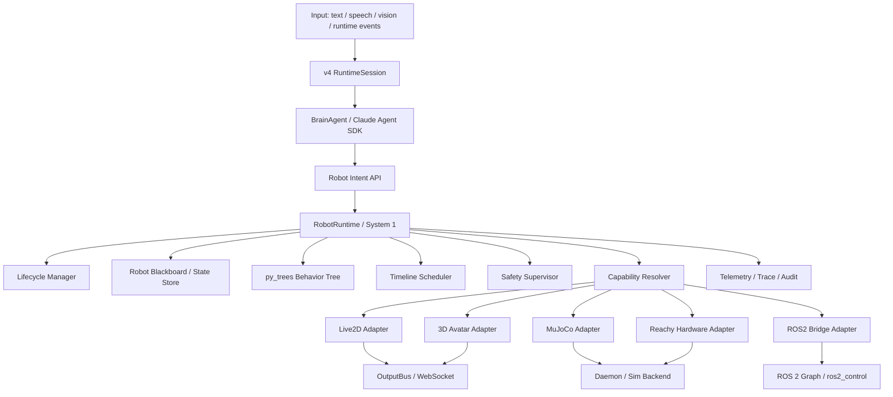

# Reachy Mini 企业级 RobotRuntime 架构规划

本文档定义 Reachy Mini v4 之后的企业级机器人运行时架构。它不是数据采集方案，也不是把当前 v4 推倒重写；它是在现有 v4 `RuntimeSession / BrainAgent / ActionRuntime / OutputBus` 之下补齐正式机器人 System 1，使 Live2D、MuJoCo、Reachy 真机、3D avatar 和 ROS2 bridge 共享同一套意图、调度、安全和适配体系。

## 1. Executive Summary

目标是把当前形态：

```text
LLM -> 具体工具 / 具体动作 -> 前端或机器人执行
```

升级为：

```text
Cognitive Brain -> EmbodiedIntent -> RobotRuntime(System 1) -> CapabilityResolver -> Adapter
```

核心判断：

- 保留 v4 主链路：`RuntimeSession`、`BrainAgent`、Claude Agent SDK、`ActionRuntime`、`OutputBus`。
- 新增 `robot_runtime` 作为正式机器人运行时，不把它塞进前端、Live2D、ActionRuntime 或 Brain。
- 模型只输出通用意图，不直接选择 Live2D 文件、MuJoCo 细节或 Reachy 电机动作。
- 行为策略基于 conversation state、semantic intent、timing anchor、modality state、runtime constraints，不基于 2D/Live2D 模型文件名做特调。
- 能用开源框架的位置直接用：当前 Python 主链路采用 `py_trees`；ROS 2 作为 bridge/control 生态接入；LeRobot/OpenPI/OpenVLA 作为学习策略层，不替代实时运行时。

## 2. Goals and Non-goals

### Goals

- 建立企业级 RobotRuntime：生命周期、行为树、调度、安全、能力解析、adapter、telemetry 全部一等化。
- 让同一个 `EmbodiedIntent` 可以落到 Live2D、MuJoCo、Reachy 真机、3D avatar。
- 让动作时序和语音回复同步由 scheduler 管理，避免动作先于回复或乱抢节奏。
- 将当前 `runtime/embodiment/EmbodimentCoordinator` 升级为兼容层，不再作为长期架构中心。
- 让 ROS-ready，而不是把 v4 AI 应用主链路一次性迁成 ROS。
- 支持未来 LeRobot 数据集/策略、OpenPI/OpenVLA 策略服务、BehaviorTree.CPP/ROS2 控制栈桥接。

### Non-goals

- 不直接全量迁移到 ROS 2。
- 不把 Claude Agent SDK、TTS/STT、WebSocket UI、Live2D 前端全部做成 ROS node。
- 不让模型看到 `live2d_motion_*`、具体 `motion3.json`、具体表情文件名作为决策工具。
- 不把 safety 交给 adapter 自行处理；adapter 只能执行通过审核的 `RobotCommand`。
- 不把 LeRobot/OpenPI/OpenVLA 当成当前主控运行时。

## 3. Current v4 Assessment

| 当前资产 | 保留方式 | 需要调整的问题 |
|---|---|---|
| `pipeline.session.RuntimeSession` | 继续作为 v4 会话和 frame 编排入口 | 新增 RobotRuntime 依赖注入和 intent 路由 |
| `reachy_brain.agent.BrainAgent` | 继续使用 Claude Agent SDK | 模型工具从具体动作转为通用机器人意图 |
| `action_runtime.ActionExecutor` | 继续负责传统 action tool 执行 | 机器人表达动作逐步迁到 RobotRuntime |
| `pipeline.output_bus.OutputBus` | 继续作为出站事件总线 | 只负责发布，不承担机器人决策 |
| `embodiment.EmbodimentFrame` | 作为轻量共享 frame 契约 | adapter 不依赖 `pipeline.frames` / Pipecat 初始化 |
| `pipeline.frames.EmbodimentFrame` | 继续作为 UI/adapter 兼容事件 | 由 RobotRuntime 产生语义化事件 |
| `runtime/embodiment/EmbodimentCoordinator` | 作为兼容层保留 | 长期能力迁到 `robot_runtime` |
| `runtime/live2d_avatar.py` + Live2D registry | 作为 capability inventory 来源 | 不再直接生成模型可见工具 |
| MuJoCo/mockup sim daemon backend | 作为 simulation adapter 执行目标 | 接入统一 RobotRuntime command |
| Reachy Mini SDK / daemon | 作为 hardware adapter 执行目标 | 所有真机动作必须经过 safety |

### 3.1 Enterprise Project Plan

项目定位：`robot_runtime` 是 Reachy Mini v4 之后的机器人运行时平台层，不是某个 Live2D 角色、某个 MuJoCo demo 或某组动作素材的定制胶水。它承担 System 1：把高层认知意图转成可调度、可审计、可回滚、可跨身体落地的机器人行为。

企业级规划按 10 条工作流并行治理，但代码落地仍遵守模块边界和依赖方向：

| 工作流 | 目标 | 主要产物 | Owner 边界 | 企业级验收 |
|---|---|---|---|---|
| Product / Interaction | 定义用户可感知的机器人交互体验 | intent taxonomy、speech-motion timing、interaction state | 不定义具体 Live2D 文件或电机角度 | 同一 intent 在 avatar/sim/hardware 下语义一致 |
| Cognitive Orchestration | 让 Brain 只输出身体无关意图 | Robot Intent API、Brain prompt、MCP tool list | 不做动作决策和安全决策 | 模型不可见具体动作文件、raw motor command |
| System 1 Runtime | 建立机器人运行时核心 | lifecycle、behavior tree、policy、scheduler、resolver | 不依赖前端和具体 SDK | 可启动/停止/恢复；异常隔离；可单测 |
| Safety Governance | 建立硬件和表达安全边界 | safety rules、safety profile、watchdog、degrade/deny reason | 不选择最佳动作素材 | 每个 command 进入 adapter 前都有 SafetyDecision |
| Embodiment Adapters | 把统一 command 落到不同身体 | Live2D、MuJoCo、Reachy、Avatar3D、ROS2 adapter | 不访问 Brain 或策略 prompt | adapter 可独立测试、可取消、可报告状态 |
| Simulation and Validation | 建立仿真优先验证路径 | MuJoCo/mock backend、integration flow、trace fixtures | 不替代真实硬件 safety | 关键 intent 可在仿真中跑通并产出 trace |
| ROS2 / Hardware Bridge | 接入机器人生态而不推倒 v4 | ROS-friendly command/state/event bridge | 不把 v4 主会话迁成 ROS node | ROS2 为 bridge，可替换或关闭 |
| Learning Policy | 接入 LeRobot/OpenPI/OpenVLA 类策略 | policy service contract、learned policy | 不直接发 RobotCommand/motor target | learning policy 只产出 BehaviorPlan，并继续经过 safety |
| Observability / Audit | 让每次动作可解释、可追踪、可复盘 | telemetry、metrics、structured log、Rerun export | 不参与控制决策 | intent -> plan -> command -> safety -> result 全链路可查 |
| Release / Operations | 让 v4 可渐进启用和回滚 | profile flags、example config、compat tests | 不隐藏破坏性变更 | `robot_runtime.enabled=false` 时旧路径不变 |

项目阶段不按“第一版/最小版”拆，而按企业级能力闭环拆；每个阶段都必须有代码、配置、测试和回滚条件：

| 阶段 | 交付目标 | 必备能力 | 退出条件 |
|---|---|---|---|
| Foundation | 建立稳定契约和配置入口 | contracts、config、public API、profile flags | 字段可序列化、可校验、可向后兼容 |
| Runtime Core | 建立 System 1 主循环 | lifecycle、state、blackboard、behavior tree、policy engine | Runtime 可独立 start/stop/tick，异常不拖垮 Brain |
| Intent Migration | 模型工具从具体动作迁移到通用意图 | `emit_embodied_intent`、state/trace/metrics tools、legacy hide flag | intent-only 模式下模型不再看到具体 Live2D tool |
| Execution Plane | 建立调度、安全、能力解析和 adapter 执行 | scheduler、safety、resolver、capability registry、adapter lifecycle | future plan 不提前执行，stop 会取消 active command 和 pending plan |
| Multi-embodiment | 支持不同身体复用同一意图 | Live2D、MuJoCo、Reachy、Avatar3D、ROS2 facade | 同一 intent 能跨 adapter 落地或给出结构化不可执行原因 |
| Enterprise Observability | 建立运维和审计闭环 | structured log、metrics、trace timeline、behavior tree snapshot、visualization export | 每个失败都能定位到 source/plan/command/safety/adapter |
| External Ecosystem | 接入 ROS2 和 learning policy | ROS2 bridge、LeRobot bridge、policy service backend | 外部系统只能走 contract，不能绕过 Runtime safety |

### 3.2 Enterprise Domain Map

企业级模块不是按“动作资源”划分，而按职责域划分：

| 职责域 | 对应模块 | 核心数据 | 外部依赖方向 |
|---|---|---|---|
| Session / Brain Integration | `pipeline.session`、`reachy_brain.agent`、`reachy_brain.mcp_server` | tool definition、turn context、robot event envelope | 只依赖 `RobotIntentTools` 和 `RobotRuntime` facade |
| Runtime Contracts | `robot_runtime.contracts`、`robot_runtime.config`、`robot_runtime.errors` | `EmbodiedIntent`、`BehaviorPlan`、`RobotCommand`、`RobotEvent`、config dataclasses | 不依赖 adapter、Brain、前端 |
| State and Lifecycle | `lifecycle.py`、`state.py`、`blackboard.py` | `RobotState`、`AdapterState`、`SafetyState`、blackboard snapshot | 只依赖 contracts |
| Behavior and Policy | `behavior_tree.py`、`policy.py`、`policies/*` | `PolicyContext`、`PolicyResult`、`BehaviorPlan` | 可读 state/capabilities，不执行 adapter |
| Scheduling and Safety | `scheduler.py`、`safety.py` | `ScheduledPlan`、`ScheduleDecision`、`SafetyDecision` | 不依赖具体 adapter SDK |
| Capability Resolution | `capabilities.py`、`resolver.py` | `Capability`、`CapabilityQuery`、`ResolutionResult` | 读取 adapter capability inventory，不读取 Brain prompt |
| Execution Adapters | `adapters/base.py`、`adapters/factory.py`、`adapters/live2d.py`、`adapters/mujoco.py`、`adapters/reachy.py`、`adapters/avatar3d.py`、`adapters/ros2.py` | `RobotCommand`、`AdapterResult`、adapter state/options | 只能执行 safety-approved command |
| Bridges | `bridges/ros2_bridge.py`、`bridges/lerobot_bridge.py`、`bridges/policy_service.py` | ROS-friendly dict、dataset/action record、policy request/response | 作为边界适配，不接管 Runtime |
| Observability | `telemetry.py`、`metrics.py`、`structured_log.py`、`visualization.py`、`mirrors.py` | trace timeline、metrics snapshot、JSONL log、Rerun record | 只消费 event/state，不参与决策 |
| Operations / Profiles | `profiles/*/profiles/*.jsonl`、`robot_runtime.example.config.jsonl` | runtime flags、adapter options、safety profiles | 配置只进入强类型 config 和 adapter options |

### 3.3 Field Ownership Rules

字段按责任归属治理，避免不同模块偷改彼此语义：

| 字段类别 | 示例字段 | Owner | 写入位置 | 消费位置 |
|---|---|---|---|---|
| Trace identity | `turn_id`、`intent_id`、`plan_id`、`step_id`、`command_id`、`event_id` | Runtime contracts | intent/tool/policy/resolver/runtime | telemetry、structured log、debug tools |
| Semantic intent | `intent_type`、`affect`、`target`、`reason` | Brain / policy | `EmbodiedIntent` | policy engine、audit |
| Timing | `speech_relation`、`timing_anchor`、`start_after_ms`、`deadline_ms`、`duration_ms` | policy + scheduler | `EmbodiedIntent`、`BehaviorPlan`、`BehaviorStep` | scheduler、runtime tick、trace |
| Modality/channel | `modalities`、`channels`、`parallel_group`、`exclusive_channels` | policy + scheduler | intent/plan/step | resolver、scheduler、safety |
| Safety | `safety_profile`、`active_limits`、`safety_envelope`、`effective_limits`、`reasons` | safety supervisor | config/state/decision/command | adapter、telemetry、operator tools |
| Adapter execution | `adapter_id`、`capability_id`、`command_type`、`payload`、`cancellation_policy` | resolver + adapter | `RobotCommand` / adapter options | adapter only; Brain 不可见 |
| Observability | `severity`、`event_type`、`status`、`payload`、`duration_ms`、`error_code` | runtime + adapter | `RobotEvent`、`AdapterResult` | trace、metrics、structured log |

## 4. Target Architecture



## 5. Open-source Framework Strategy

| 框架 | 采用层级 | 采用方式 | 不采用为 |
|---|---|---|---|
| [`py_trees`](https://github.com/splintered-reality/py_trees) | RobotRuntime 行为编排 | Python 主链路直接依赖，用 behavior tree、blackboard、selector、sequence、parallel | 不用手写一套自研行为树 |
| [ROS 2 Managed Nodes](https://design.ros2.org/articles/node_lifecycle.html) | Lifecycle 概念和 ROS bridge | 借鉴生命周期状态；后续 `ros2_bridge.py` 暴露 robot state / command / events | 不把整个 v4 AI 应用改成 ROS 主程序 |
| [BehaviorTree.CPP](https://github.com/BehaviorTree/BehaviorTree.CPP) | 未来 ROS2/高实时执行 | 需要 C++/ROS2 控制栈时接入 | 当前不替代 Python `py_trees` |
| [LeRobot](https://github.com/huggingface/lerobot) | 数据集、训练、策略部署 | 通过 `lerobot_bridge.py` 导出/导入 policy 和 dataset 格式 | 不作为实时调度器 |
| [OpenPI](https://github.com/Physical-Intelligence/openpi) | VLA policy backend | 作为远程/本地策略服务接入 `policy_backends/` | 不直接控制硬件 |
| [OpenVLA](https://github.com/openvla/openvla) | VLA policy backend | 用于未来视觉-语言-动作策略实验 | 不替代 safety/scheduler |
| [Isaac Lab](https://github.com/isaac-sim/IsaacLab) | 大规模仿真扩展 | 云端/训练仿真后续接入 | 不替代当前 MuJoCo |
| [ManiSkill](https://github.com/haosulab/ManiSkill) | 操作技能仿真扩展 | 做技能训练/评测时接入 | 不替代当前表达型机器人 runtime |

## 6. Module Layout

目标目录：

```text
src/reachy_mini/robot_runtime/
  __init__.py
  contracts.py
  config.py
  errors.py
  runtime.py
  lifecycle.py
  state.py
  blackboard.py
  behavior_tree.py
  policy.py
  scheduler.py
  safety.py
  resolver.py
  capabilities.py
  telemetry.py
  metrics.py
  structured_log.py
  visualization.py
  mirrors.py
  tools.py
  adapters/
    __init__.py
    base.py
    factory.py
    live2d.py
    mujoco.py
    reachy.py
    avatar3d.py
    ros2.py
  bridges/
    __init__.py
    lerobot_bridge.py
    ros2_bridge.py
    policy_service.py
  policies/
    __init__.py
    attention_policy.py
    idle_policy.py
    learned_policy.py
    social_policy.py
    speech_sync_policy.py
    task_policy.py
```

测试目录：

```text
tests/unit_tests/robot_runtime/
  test_contracts.py
  test_config.py
  test_lifecycle.py
  test_blackboard.py
  test_behavior_tree.py
  test_policy.py
  test_scheduler.py
  test_safety.py
  test_resolver.py
  test_capabilities.py
  test_runtime.py
  test_tools.py
  test_telemetry.py
  test_visualization.py
  test_adapter_factory.py
  test_live2d_adapter.py
  test_mujoco_adapter.py
  test_reachy_adapter.py
  test_avatar3d_adapter.py
  test_ros2_adapter.py
  test_bridges.py

tests/integration_tests/
  test_robot_runtime_enterprise_flow.py
```

## 7. Module Responsibilities

| 模块 | 负责 | 不负责 | 主要依赖 |
|---|---|---|---|
| `contracts.py` | 所有跨模块数据契约 | 具体业务逻辑 | 标准库 dataclasses / typing |
| `embodiment.py` | 跨 pipeline 和 adapter 的轻量表达 frame | pipeline 编排、TTS、SDK frame 逻辑 | 标准库 dataclasses / typing |
| `config.py` | profile JSONL 解析后的强类型运行时配置 | adapter 私有行为逻辑 | contracts |
| `errors.py` | Runtime 边界异常类型 | 异常恢复策略 | 标准库 |
| `runtime.py` | RobotRuntime facade、intent 接收、tick loop、依赖编排 | 具体 adapter 实现 | lifecycle、blackboard、behavior_tree、scheduler、safety、resolver |
| `lifecycle.py` | 机器人运行时和 adapter 生命周期 | 动作决策 | contracts |
| `state.py` | RobotState、InteractionState、ModalityState 快照 | 持久化 | contracts |
| `body_agnostic.py` | 模型和外部 policy 边界的身体无关字段校验 | adapter 路由和动作执行 | 标准库 |
| `blackboard.py` | py_trees blackboard 封装和字段初始化 | 行为逻辑 | py_trees、state |
| `behavior_tree.py` | 顶层行为树结构和 node 注册 | adapter 执行细节 | py_trees、policies |
| `scheduler.py` | timing anchor、优先级、deadline、并发/互斥 | 安全限幅 | contracts、state |
| `safety.py` | 安全审核、降级、拒绝、紧急停止 | 选具体身体动作 | contracts、capabilities |
| `resolver.py` | intent/plan 到 capability 和 adapter command 的解析 | 直接执行硬件 | contracts、capabilities、adapters.base |
| `capabilities.py` | capability inventory、查询、匹配评分 | 行为策略 | contracts |
| `policy.py` | 组合 policy 接口和 policy result | py_trees tick loop | contracts、state |
| `telemetry.py` | trace、metrics、audit event | 控制决策 | contracts |
| `metrics.py` | 从 `RobotEvent` 派生运行时指标 | 采样或业务埋点 SDK | contracts |
| `structured_log.py` | JSONL 审计日志 schema 和序列化 | 日志存储后端 | contracts |
| `visualization.py` | Rerun-compatible timeline record/export | 控制决策、强依赖 UI | telemetry、contracts |
| `smoke.py` | 可重复执行的本机 smoke 和 ROS2/Reachy 外部 preflight | 把 skipped 外部门禁伪装成 passed | adapters、runtime、tools |
| `mirrors.py` | 将 runtime state/event best-effort 镜像到桥接 adapter | 控制主链路可靠性保证 | adapters.base、contracts |
| `tools.py` | 模型可见 Robot Intent API facade | 具体动作工具、adapter 私有参数 | runtime、contracts |
| `adapters/base.py` | Adapter 协议和基类 | 具体身体实现 | contracts |
| `adapters/factory.py` | 根据 profile 装配 enabled adapters | adapter 执行逻辑 | config、adapters |
| `adapters/live2d.py` | Live2D capability inventory 和 websocket event 落地 | 策略判断 | base、contracts |
| `adapters/mujoco.py` | MuJoCo daemon command 落地 | VLA 训练 | base、ReachyMini SDK/io |
| `adapters/reachy.py` | 真机 command 落地 | 越过 safety 执行动作 | base、ReachyMini SDK |
| `adapters/avatar3d.py` | 3D avatar animation/blendshape/gaze frame 落地 | 3D renderer 实现 | base、contracts |
| `adapters/ros2.py` | 安全 command 转 ROS-friendly message，镜像 state/event | ROS node 生命周期管理 | base、bridges |
| `bridges/ros2_bridge.py` | ROS2 topic/action/service 桥接 | v4 主会话 | contracts |
| `bridges/lerobot_bridge.py` | LeRobot dataset/policy 格式桥接 | 实时安全 | contracts |
| `bridges/policy_service.py` | 外部 policy backend 请求/响应 contract | 策略模型托管 | contracts |
| `policies/learned_policy.py` | 将外部 policy action 转为 BehaviorPlan | 直接生成 RobotCommand 或 motor target | policy、bridges |

### 7.1 Public API Surface

每个模块必须声明 `__all__`，只暴露稳定接口。未列入 `__all__` 的对象视为内部实现，不能被 Brain、profile loader、adapter 外部直接引用。

| 模块 | 公开对象 | 说明 |
|---|---|---|
| `robot_runtime.__init__` | `RobotRuntime`、`RobotRuntimeConfig`、核心 contracts | 面向 v4 session 的唯一包级入口 |
| `contracts.py` | `EmbodiedIntent`、`RobotState`、`BehaviorPlan`、`BehaviorStep`、`Capability`、`RobotCommand`、`SafetyDecision`、`AdapterResult`、`RobotEvent` | 跨模块契约 |
| `runtime.py` | `RobotRuntime`、`RobotRuntimeDependencies` | System 1 facade |
| `config.py` | `RobotRuntimeConfig`、`RobotAdapterConfig`、`SafetyProfileConfig` | profile JSONL 解析后的强类型配置 |
| `lifecycle.py` | `LifecycleManager`、`LifecycleTransition` | runtime 和 adapter 生命周期 |
| `state.py` | `RobotStateStore`、`RobotStateSnapshot` | 状态读写和快照 |
| `body_agnostic.py` | `validate_body_agnostic_value()` | 递归拒绝 adapter 私有字段、具体资产名、raw motor/joint/command payload |
| `behavior_tree.py` | `build_robot_tree()`、`RobotBehaviorTree` | py_trees 顶层树构建 |
| `policy.py` | `RobotPolicyEngine`、`PolicyContext`、`PolicyResult`、`PlanPolicy`、`create_default_policy_engine()` | `EmbodiedIntent` 到 `BehaviorPlan` 的策略编译；可插入 learned policy backend |
| `tools.py` | `RobotIntentTools` | 模型可见的唯一机器人意图工具 facade |
| `scheduler.py` | `TimelineScheduler`、`ScheduledPlan` | 时间锚和计划排序 |
| `safety.py` | `SafetySupervisor`、`SafetyRule` | 强制安全审核 |
| `resolver.py` | `CapabilityResolver`、`ResolutionResult` | capability 匹配和 command 生成 |
| `capabilities.py` | `CapabilityRegistry`、`CapabilityQuery` | adapter capability inventory |
| `telemetry.py` | `RobotTelemetrySink`、`RobotTraceContext` | trace 和 metrics |
| `metrics.py` | `RobotMetricsSnapshot` | 由 event history 派生的可观测指标 |
| `structured_log.py` | `RobotStructuredLogRecord`、`structured_log_lines()`、`structured_log_records()` | 审计 JSONL 输出 |
| `visualization.py` | `RobotVisualizationRecord`、`RerunTimelineExporter`、`export_timeline_to_rerun()` | 可选 Rerun-compatible trace 导出 |
| `smoke.py` | `SmokeCheckResult`、`SmokeSuiteResult`、`run_robot_runtime_smoke_suite()` | 本机 Runtime smoke 与 ROS2/Reachy 外部 preflight 的结构化结果 |
| `mirrors.py` | `RuntimeEventMirror`、`RuntimeStateMirror`、`publish_event_mirrors()`、`publish_state_mirrors()` | bridge adapter 的 best-effort state/event mirror |
| `adapters.base` | `RobotAdapter`、`AdapterContext` | 所有 adapter 的协议 |
| `adapters.factory` | `AdapterBuildResult`、`build_profile_adapters()`、`adapter_config_options()` | profile 驱动 adapter 装配 |
| `policies.learned_policy` | `LearnedPolicy` | 外部 policy action 到 `BehaviorPlan` 的安全入口 |
| `bridges.policy_service` | `PolicyServiceBackend`、`PolicyServiceRequest`、`PolicyServiceResponse` | learned policy backend contract |

### 7.2 Module Completion Definition

| 模块 | 完成定义 |
|---|---|
| `contracts.py` | 字段、默认值、枚举、序列化、反序列化、向后兼容测试全部通过 |
| `config.py` | profile JSONL 可以解析 runtime、adapter、safety profile；未知 adapter 私有字段只进入 `options` |
| `runtime.py` | 可启动/停止 tick loop；可接收 intent；错误不拖垮 `RuntimeSession` |
| `lifecycle.py` | 支持所有 lifecycle transition；非法 transition 有明确异常和 trace |
| `behavior_tree.py` | 树结构可渲染；关键节点可单测；tick 不执行阻塞 I/O |
| `policy.py` | 默认 policy chain 可测试；策略只产出 `BehaviorPlan`，不直接访问 adapter 或执行硬件 |
| `tools.py` | 模型可见工具只收发通用意图、状态、trace、metrics、cancel，不暴露 adapter 私有 payload |
| `metrics.py` | 指标可由事件流确定性派生；失败/超时/安全拒绝均可计数 |
| `structured_log.py` | JSONL schema 固定，有 schema version，包含 trace identity 和 payload |
| `visualization.py` | 不强依赖 `rerun-sdk`；可注入 recorder；能从 trace timeline 导出有路径和时间戳的记录 |
| `mirrors.py` | state/event mirror best-effort 失败只记录 warning，不影响 Runtime 主流程 |
| `scheduler.py` | 支持 timing anchor、deadline、priority、channel mutex、fallback |
| `safety.py` | 所有 deny/degrade 都输出 `SafetyDecision.reasons` |
| `resolver.py` | 同一 intent 可解析到多个 adapter；匹配结果有 score 和 reason |
| `adapters/factory.py` | 可从 `RobotRuntimeConfig` 统一装配或跳过 adapter，跳过原因可审计 |
| `adapters/live2d.py` | 不暴露具体 Live2D 动作给 Brain；只输出兼容 `EmbodimentFrame` |
| `adapters/mujoco.py` | 能驱动 mockup/MuJoCo 仿真；不依赖前端 |
| `adapters/reachy.py` | hardware mode 默认关闭；所有命令带 safety envelope；支持字段驱动的 gaze、pose、antenna、body yaw、recorded move 映射 |
| `adapters/avatar3d.py` | 只输出 renderer-agnostic animation/blendshape/gaze frame，不绑定具体 3D 引擎 |
| `adapters/ros2.py` | 不导入 ROS runtime；只生成 ROS-friendly message 并可 mirror state/event |
| `bridges/policy_service.py` | 外部 policy backend 只能返回 action record，不能返回 `RobotCommand` 或电机目标 |
| `policies/learned_policy.py` | learned action 会被编译成 `BehaviorPlan` 并继续经过 resolver、scheduler、safety |

## 8. Dependency Rules

依赖方向：

```text
BrainAgent
  -> Robot Intent API
    -> robot_runtime.runtime
      -> contracts / lifecycle / state / scheduler / safety / resolver
        -> adapters
          -> daemon / SDK / OutputBus / ROS2
```

硬规则：

- `robot_runtime` 不能依赖 `profiles/sim_front_app/static/main.js` 或任何前端实现。
- `adapters` 不能调用 Brain、Claude Agent SDK、LLM client。
- `safety.py` 不能依赖具体 adapter；它只看 `Capability`、`RobotCommand`、`RobotState`。
- `resolver.py` 可以读取 capability metadata，但不能直接访问 Live2D 文件名做策略特判。
- `BrainAgent` 只能看到 Robot Intent API，不看到 adapter 内部 capability id。
- `OutputBus` 是发布通道，不是决策模块。
- 真机 adapter 不允许绕过 `SafetySupervisor` 执行 command。

## 9. Core Contracts and Field Descriptions

### 9.1 EmbodiedIntent

模型或高层 policy 输出的身体意图。它是跨身体语义，不是具体动作。

| 字段 | 类型 | 必填 | 描述 |
|---|---|---|---|
| `intent_id` | `str` | 是 | 全局唯一意图 id，用于 trace |
| `turn_id` | `str` | 否 | 关联对话 turn |
| `source` | `str` | 是 | `brain`、`policy`、`system`、`operator` |
| `created_at_ms` | `int` | 是 | 创建时间 |
| `intent_type` | `str` | 是 | `greet`、`listen`、`think`、`speak`、`acknowledge`、`refuse`、`task_execute`、`idle` 等 |
| `affect` | `str | None` | 否 | `neutral`、`friendly`、`curious`、`serious`、`happy` 等 |
| `target` | `dict | None` | 否 | 目标对象，如 user、screen、object、direction |
| `intensity` | `float` | 是 | 0.0 到 1.0，表达强度 |
| `priority` | `int` | 是 | 调度优先级，数值越高越重要 |
| `speech_relation` | `str` | 是 | `before_speech`、`during_speech`、`after_speech`、`idle`、`interrupt` |
| `timing_anchor` | `str | None` | 否 | 建议锚点，如 `speech_start`、`speech_chunk`、`turn_end` |
| `modalities` | `list[str]` | 否 | 期望通道：`gaze`、`head`、`body`、`face`、`gesture`、`voice` |
| `constraints` | `dict` | 否 | 运行约束，如最大时长、不可打断、仅仿真 |
| `reason` | `str` | 否 | 模型或 policy 的解释，供审计 |
| `metadata` | `dict` | 否 | 扩展字段，不参与核心策略 |

### 9.2 RobotState

RobotRuntime 的状态快照。

| 字段 | 类型 | 描述 |
|---|---|---|
| `state_id` | `str` | 状态快照 id |
| `observed_at_ms` | `int` | 状态时间 |
| `lifecycle` | `str` | `unconfigured`、`inactive`、`active`、`error` 等 |
| `mode` | `str` | `simulation`、`hardware`、`avatar_only`、`hybrid` |
| `active_turn_id` | `str | None` | 当前对话 turn |
| `speech_state` | `str` | `idle`、`preparing`、`speaking`、`ended` |
| `input_state` | `str` | `idle`、`listening`、`transcribing` |
| `attention_target` | `dict | None` | 当前注意力目标 |
| `active_behaviors` | `list[str]` | 当前行为树活跃节点 |
| `active_commands` | `list[str]` | 正在执行的 command id |
| `adapter_states` | `dict[str, AdapterState]` | 各身体 adapter 状态 |
| `safety_state` | `SafetyState` | 安全状态 |
| `capability_revision` | `str` | capability inventory 版本 |

### 9.2.1 AdapterState

单个 adapter 对 Runtime 暴露的状态。它必须足够支撑 lifecycle、watchdog、cancel 和 audit，不能只返回“在线/离线”。

| 字段 | 类型 | 描述 |
|---|---|---|
| `adapter_id` | `str` | adapter 唯一 id，如 `live2d`、`mujoco`、`reachy`、`avatar3d`、`ros2` |
| `lifecycle` | `str` | adapter 生命周期；必须与 `LifecycleState` 枚举一致 |
| `mode` | `str` | adapter 当前运行模式；必须与 `RuntimeMode` 枚举一致 |
| `active_command_ids` | `list[str]` | adapter 正在执行或尚未完成取消的 command id |
| `error` | `str | None` | adapter 最近一次生命周期或执行错误，供状态查询和 operator 诊断 |
| `metadata` | `dict` | adapter 私有状态，如 heartbeat、dry_run、scene、namespace；不得进入 Brain prompt |

### 9.2.2 SafetyState

Runtime 聚合安全状态，由 `SafetySupervisor` 和配置 profile 共同维护。

| 字段 | 类型 | 描述 |
|---|---|---|
| `emergency_stop` | `bool` | 紧急停止总状态；为 `true` 时 safety 必须 deny 非恢复类 command |
| `degraded` | `bool` | 当前是否处于降级模式，例如仿真可用但硬件不可用 |
| `active_limits` | `dict` | 当前生效限制，如 `max_duration_ms`、`max_timeout_ms`、`max_intensity`、`allowed_modes`、`blocked_adapters` |
| `reasons` | `list[str]` | 当前安全状态原因，供 operator UI 和 structured log 使用 |

### 9.3 BehaviorPlan

RobotRuntime 根据意图生成的可执行计划。

| 字段 | 类型 | 描述 |
|---|---|---|
| `plan_id` | `str` | 计划 id |
| `intent_id` | `str` | 来源意图 |
| `status` | `str` | `draft`、`scheduled`、`running`、`completed`、`cancelled`、`failed` |
| `priority` | `int` | 调度优先级 |
| `timing_anchor` | `str` | 执行锚点 |
| `start_after_ms` | `int | None` | 最早开始时间 |
| `deadline_ms` | `int | None` | 最晚开始/完成时间 |
| `duration_ms` | `int | None` | 目标持续时间 |
| `interruptible` | `bool` | 是否允许被更高优先级打断 |
| `channels` | `list[str]` | 计划使用的通道 |
| `steps` | `list[BehaviorStep]` | 计划步骤 |
| `constraints` | `dict` | 调度和能力约束 |
| `fallback_policy` | `str` | `skip`、`degrade`、`retry`、`safe_idle` |

### 9.4 BehaviorStep

| 字段 | 类型 | 描述 |
|---|---|---|
| `step_id` | `str` | 步骤 id |
| `plan_id` | `str` | 所属计划 |
| `channel` | `str` | `gaze`、`head`、`face`、`gesture`、`body`、`voice` |
| `capability_query` | `dict` | capability 查询条件 |
| `timing` | `dict` | step 内部时间参数 |
| `parallel_group` | `str | None` | 并行组 id |
| `preconditions` | `list[str]` | 前置条件 |
| `postconditions` | `list[str]` | 后置状态 |
| `timeout_ms` | `int` | 超时 |
| `required` | `bool` | 失败时是否影响整个 plan |

### 9.5 Capability

某个身体 adapter 宣告的能力。Live2D 文件、MuJoCo 控制、真机动作都被归一成 capability。

| 字段 | 类型 | 描述 |
|---|---|---|
| `capability_id` | `str` | 能力 id，内部使用 |
| `adapter_id` | `str` | 所属 adapter |
| `embodiment` | `str` | `live2d`、`mujoco`、`reachy`、`avatar3d`、`ros2` |
| `modality` | `str` | `expression`、`motion`、`gaze`、`speech_motion`、`navigation` |
| `channels` | `list[str]` | 可控制通道 |
| `semantic_tags` | `list[str]` | `greet`、`positive`、`thinking` 等通用语义标签 |
| `affect_range` | `list[str]` | 支持的情绪范围 |
| `intensity_range` | `tuple[float, float]` | 支持强度 |
| `input_schema` | `dict` | adapter command payload schema |
| `constraints` | `dict` | 速度、角度、互斥、模式限制 |
| `timing_profile` | `dict` | 平均时长、启动延迟、可循环性 |
| `interruptibility` | `str` | `none`、`soft`、`hard` |
| `source_asset` | `dict | None` | 来源资源；仅 adapter 内部使用 |
| `confidence` | `float` | resolver 匹配置信度 |

### 9.6 RobotCommand

通过 safety 后发给 adapter 的命令。

| 字段 | 类型 | 描述 |
|---|---|---|
| `command_id` | `str` | 命令 id |
| `plan_id` | `str` | 来源计划 |
| `step_id` | `str` | 来源步骤 |
| `adapter_id` | `str` | 目标 adapter |
| `capability_id` | `str` | 目标能力 |
| `command_type` | `str` | `play_motion`、`apply_expression`、`goto_pose`、`set_gaze`、`stop` |
| `payload` | `dict` | adapter 私有参数 |
| `start_at_ms` | `int | None` | 计划开始时间 |
| `duration_ms` | `int | None` | 计划持续时间 |
| `timeout_ms` | `int` | 超时 |
| `cancellation_policy` | `str` | `ignore`、`soft_stop`、`hard_stop` |
| `safety_envelope` | `dict` | safety 写入的有效限制 |

### 9.7 SafetyDecision

| 字段 | 类型 | 描述 |
|---|---|---|
| `decision_id` | `str` | 安全决策 id |
| `checked_at_ms` | `int` | 审核时间 |
| `command_id` | `str` | 被审核命令 |
| `status` | `str` | `allow`、`deny`、`degrade`、`delay` |
| `reasons` | `list[str]` | 拒绝或降级原因 |
| `effective_limits` | `dict` | 实际生效限制 |
| `replacement_command` | `RobotCommand | None` | 降级后命令 |
| `operator_action_required` | `bool` | 是否需要人工处理 |
| `expires_at_ms` | `int | None` | 决策有效期 |

### 9.8 AdapterResult

| 字段 | 类型 | 描述 |
|---|---|---|
| `command_id` | `str` | 对应命令 |
| `adapter_id` | `str` | adapter |
| `status` | `str` | `accepted`、`running`、`completed`、`cancelled`、`failed`、`timeout` |
| `started_at_ms` | `int | None` | 开始时间 |
| `ended_at_ms` | `int | None` | 结束时间 |
| `duration_ms` | `int | None` | 实际耗时 |
| `error_code` | `str | None` | 错误码 |
| `error_message` | `str | None` | 错误说明 |
| `telemetry` | `dict` | adapter 返回的执行指标 |

### 9.9 RobotEvent

| 字段 | 类型 | 描述 |
|---|---|---|
| `event_id` | `str` | 事件 id |
| `ts_ms` | `int` | 事件时间 |
| `source` | `str` | `runtime`、`scheduler`、`safety`、`adapter`、`policy` |
| `severity` | `str` | `debug`、`info`、`warning`、`error`、`critical` |
| `event_type` | `str` | `intent_received`、`plan_scheduled`、`command_started`、`safety_denied` 等 |
| `turn_id` | `str | None` | 对话 turn |
| `intent_id` | `str | None` | 关联意图 |
| `plan_id` | `str | None` | 关联计划 |
| `command_id` | `str | None` | 关联命令 |
| `status` | `str | None` | 当前状态 |
| `payload` | `dict` | 事件数据 |
| `reason` | `str | None` | 可读原因 |

### 9.10 Canonical Enumerations

字段枚举必须集中定义，不能在 adapter 或 policy 里散落字符串。

| 枚举 | 允许值 | 使用字段 |
|---|---|---|
| `LifecycleState` | `unconfigured`、`configuring`、`inactive`、`activating`、`active`、`deactivating`、`error`、`recovering`、`shutdown` | `RobotState.lifecycle` |
| `RuntimeMode` | `avatar_only`、`simulation`、`hardware`、`hybrid` | `RobotState.mode`、`RobotRuntimeConfig.mode` |
| `IntentSource` | `brain`、`policy`、`system`、`operator` | `EmbodiedIntent.source` |
| `IntentType` | `greet`、`listen`、`think`、`speak`、`acknowledge`、`agree`、`refuse`、`attention_shift`、`task_execute`、`idle`、`recover` | `EmbodiedIntent.intent_type` |
| `SpeechRelation` | `before_speech`、`during_speech`、`after_speech`、`idle`、`interrupt` | `EmbodiedIntent.speech_relation` |
| `TimingAnchor` | `turn_start`、`speech_prepare`、`speech_start`、`speech_chunk`、`speech_end`、`turn_end`、`idle`、`interrupt`、`task_start`、`task_progress`、`task_end` | `timing_anchor` |
| `PlanStatus` | `draft`、`scheduled`、`running`、`completed`、`cancelled`、`failed`、`degraded` | `BehaviorPlan.status` |
| `SafetyStatus` | `allow`、`deny`、`degrade`、`delay` | `SafetyDecision.status` |
| `AdapterResultStatus` | `accepted`、`running`、`completed`、`cancelled`、`failed`、`timeout` | `AdapterResult.status` |
| `FallbackPolicy` | `skip`、`degrade`、`retry`、`safe_idle` | `BehaviorPlan.fallback_policy` |

### 9.11 Contract Validation Rules

| 规则 | 描述 |
|---|---|
| ID 规则 | `intent_id`、`plan_id`、`step_id`、`command_id`、`event_id` 必须全局唯一，可用 ULID/UUID |
| 时间规则 | 所有 `*_at_ms` 使用 epoch milliseconds；同一 command 的 `ended_at_ms` 不能早于 `started_at_ms` |
| 强度规则 | `EmbodiedIntent.intensity` 必须在 `[0.0, 1.0]` |
| 优先级规则 | `priority` 使用 0 到 100；system safety/interrupt 预留 90 到 100 |
| 模态规则 | `modalities` 和 `channels` 必须来自受控集合：`gaze`、`head`、`body`、`face`、`gesture`、`voice`、`navigation` |
| 安全规则 | `RobotCommand` 进入 adapter 前必须有对应 `SafetyDecision(status=allow|degrade)` |
| Adapter 规则 | adapter 只能返回 `AdapterResult`，不能直接抛出未分类异常到 Brain turn |
| 兼容规则 | 新字段只能向后兼容追加；删除字段必须经过 deprecation window |

## 10. Robot Intent API

模型可见工具只保留通用 API：

```text
emit_embodied_intent(intent_type, affect, target, intensity, priority, speech_relation, modalities, constraints, reason)
query_robot_state()
request_robot_task(task_type, target, constraints)
cancel_robot_task(task_id, reason)
```

`cancel_robot_task` 可取消已排队的 plan，也可通过 `command_id`、`plan_id`、`step_id` 或 payload 中的 `task_id` 取消正在执行的 adapter command；对尚未执行的 scheduled plan，会扫描 `BehaviorPlan.steps[*].capability_query.payload.target.task_id` / `constraints.task_id` 等字段；取消请求会输出结构化 `task_cancel_requested` 事件。

模型不可见：

```text
live2d_motion_huishou
live2d_expression_xxx
specific motion3.json name
raw motor command
adapter private payload
```

### 10.1 Robot Intent API Field Dictionary

`RobotIntentTools` 是模型可见的唯一机器人入口。所有字段必须是身体无关语义，不能出现 `adapter_id`、`command_type`、`motion3.json`、Live2D 表情文件名、MuJoCo actuator 名、Reachy motor name 等 adapter 私有标识。
`target`、`constraints`、`reason` 会递归拒绝 adapter 私有字段和标识符；失败会返回 `tool_validation_failed`，并写入 `tool_rejected` 事件，不进入调度链。

| 工具 | 字段 | 类型 | 必填 | 描述 |
|---|---|---|---|---|
| `emit_embodied_intent` | `intent_type` | `str` | 是 | 通用意图类型，如 `greet`、`listen`、`think`、`speak`、`acknowledge`、`task_execute` |
| `emit_embodied_intent` | `affect` | `str | None` | 否 | 语义情绪，如 `friendly`、`curious`、`serious` |
| `emit_embodied_intent` | `target` | `dict | None` | 否 | 注意力或任务目标，如用户、屏幕、物体、方向；不能是 adapter 私有资源 |
| `emit_embodied_intent` | `intensity` | `float` | 否 | 表达强度，范围 `[0.0, 1.0]` |
| `emit_embodied_intent` | `priority` | `int` | 否 | 调度优先级，范围 `0..100`；安全和系统中断预留高优先级 |
| `emit_embodied_intent` | `speech_relation` | `str` | 否 | 与语音关系：`before_speech`、`during_speech`、`after_speech`、`idle`、`interrupt` |
| `emit_embodied_intent` | `timing_anchor` | `str | None` | 否 | 时间锚点，如 `speech_start`、`speech_end`、`task_start` |
| `emit_embodied_intent` | `modalities` | `list[str]` | 否 | 期望通道，如 `gaze`、`head`、`face`、`gesture`、`body`、`voice` |
| `emit_embodied_intent` | `constraints` | `dict` | 否 | 运行约束，如 `max_duration_ms`、`require_simulation`、`interruptible` |
| `emit_embodied_intent` | `reason` | `str` | 否 | 模型或上层策略的可读解释，用于审计 |
| `emit_embodied_intent` | `turn_id` | `str` | 否 | 当前对话 turn id，用于 trace 关联 |
| `emit_embodied_intent` | return.`intent` | `dict` | 是 | 规范化后的 `EmbodiedIntent` |
| `emit_embodied_intent` | return.`events` | `list[dict]` | 是 | Runtime 产生的 `RobotEvent` 列表 |
| `emit_embodied_intent` | return.`error` | `dict | None` | 否 | 字段校验失败时返回 `tool_validation_failed`，并写入 `tool_rejected` 事件；不会直接拖垮 Brain turn |
| `query_robot_state` | return.`state` | `dict` | 是 | 当前 `RobotState` 快照 |
| `query_robot_trace` | `turn_id` / `intent_id` / `plan_id` / `command_id` | `str` | 至少一个 | 追踪某个 turn/intent/plan/command 的完整事件链 |
| `query_robot_trace` | return.`events` | `list[dict]` | 是 | 匹配 trace 的事件列表 |
| `query_robot_trace` | return.`complete` | `bool` | 是 | trace 是否包含 intent、plan、command、safety、terminal event |
| `query_robot_trace` | return.`error` | `dict | None` | 否 | 缺少 trace id 等校验失败时返回结构化错误，并写入 `tool_rejected` 事件 |
| `query_robot_metrics` | return | `dict` | 是 | Runtime 指标快照 |
| `query_robot_behavior_tree` | return | `dict` | 是 | 当前行为树节点状态和 blackboard 快照 |
| `query_robot_structured_log` | `limit` | `int` | 否 | 返回最近 N 条 JSONL 审计日志 |
| `request_robot_task` | `task_type` | `str` | 是 | 非空长任务类型，会被转换为 `intent_type=task_execute`；该字段是任务语义 owner，不能被 `target.task_type` 覆盖 |
| `request_robot_task` | `target` | `dict | None` | 否 | 任务目标，仍保持身体无关；必须是 object，不能是字符串或 adapter 私有资源 |
| `request_robot_task` | `constraints` | `dict` | 否 | 长任务约束；必须是 object |
| `cancel_robot_task` | `task_id` | `str` | 是 | 非空 id；可为 plan id、command id、step id 或 payload 中 task id |
| `cancel_robot_task` | `reason` | `str` | 否 | 取消原因，写入 `task_cancel_requested` event |

## 11. Behavior Tree Design

顶层行为树：

```text
Root
  SafetyGate
  LifecycleGate
  InterruptHandler
  TurnCoordinator
    ListeningBehavior
    ThinkingBehavior
    SpeakingBehavior
    TaskBehavior
    IdleBehavior
  AttentionController
  ExpressionController
  MotionController
```

Blackboard 字段：

| 字段 | 描述 |
|---|---|
| `robot_state` | 当前 RobotState |
| `active_turn_id` | 当前对话 turn |
| `pending_intents` | 等待处理的 EmbodiedIntent |
| `active_plan` | 当前 BehaviorPlan |
| `speech_state` | 语音生命周期 |
| `vision_state` | 视觉观察 |
| `attention_target` | 注意力目标 |
| `safety_status` | 当前安全状态 |
| `adapter_capabilities` | capability inventory |
| `active_commands` | 正在执行的命令 |
| `interrupt_request` | 打断请求 |

Tick 策略：

- 默认 tick rate：20Hz 到 50Hz，按 profile 配置。
- UI-only / Live2D 模式可低频。
- 真机模式必须启用 watchdog 和 command timeout。
- tick 不直接执行长耗时 I/O；长动作由 adapter task 执行，`RobotState.active_commands` / blackboard / bridge mirror 可观察正在执行的 command。
- `handle_intent()` 只会立即执行当前已经 due 且属于自动执行 anchor 的 plan；带 `start_after_ms`、未来 speech/task anchor 或 deadline 约束的计划会保留在 scheduler，由 `RobotRuntime.execute_ready(anchor=...)` 或 tick loop 到点推进。默认 tick 只自动推进 `idle`、`interrupt`、`turn_start`，不会提前触发 `speech_start` / `speech_end` / `task_start` 这类外部生命周期 anchor。

## 12. Scheduler Model

统一 timing anchor：

| Anchor | 描述 |
|---|---|
| `turn_start` | 用户输入进入 turn |
| `speech_prepare` | 回复文本已形成，TTS 准备前 |
| `speech_start` | 语音开始 |
| `speech_chunk` | 语音播放中 |
| `speech_end` | 语音结束 |
| `turn_end` | turn 完成 |
| `idle` | 无活动 |
| `interrupt` | 用户打断 |
| `task_start` | 长任务开始 |
| `task_progress` | 长任务进展 |
| `task_end` | 长任务结束 |

调度字段：

| 字段 | 描述 |
|---|---|
| `anchor` | 绑定的 timing anchor |
| `offset_ms` | 相对 anchor 的偏移 |
| `deadline_ms` | 允许的最后执行时间 |
| `priority` | 优先级 |
| `interruptible` | 是否可打断 |
| `exclusive_channels` | 互斥通道 |
| `parallel_channels` | 可并行通道 |
| `fallback_policy` | 超时或冲突时策略 |

## 13. Safety Model

安全层必须强制经过，覆盖：

- lifecycle gate：未 active 不执行。
- mode gate：hardware/simulation/avatar_only 隔离。
- joint/range limit：真机角度、速度、频率限制。
- channel mutex：头、身体、表情、语音动作互斥。
- speech coordination：说话时降级大幅运动。
- command timeout：adapter 执行超过 `timeout_ms` 自动取消并返回结构化 `timeout` 事件。
- hardware watchdog：硬件 safety profile 可通过 `watchdog_timeout_ms` 要求 adapter heartbeat 新鲜度。
- emergency stop：人工或系统紧急停止。
- degraded fallback：无法执行时转为安全 idle 或低强度表达。

安全决策必须输出 reason，不能只返回 `False`。当 `SafetyDecision` 把命令降级为
`command_type=safe_idle` 时，adapter 必须把它当作一等安全命令处理，不能继续播放原始
Live2D motion、继续写入 MuJoCo target，或继续调用 Reachy 真机 SDK。

## 14. Adapter Design

Adapter 基础接口：

```python
class RobotAdapter(Protocol):
    adapter_id: str

    async def configure(self, config: dict) -> None: ...
    async def activate(self) -> None: ...
    async def deactivate(self) -> None: ...
    async def capabilities(self) -> list[Capability]: ...
    async def execute(self, command: RobotCommand) -> AdapterResult: ...
    async def cancel(self, command_id: str, reason: str) -> AdapterResult: ...
    async def state(self) -> AdapterState: ...
```

Adapter 职责：

| Adapter | 输入 | 输出 | 说明 |
|---|---|---|---|
| `Live2DAdapter` | `RobotCommand` | `EmbodimentFrame` / websocket payload | Live2D 文件只作为内部 capability source |
| `MujocoAdapter` | `RobotCommand` | daemon command / sim state | 仿真与真机共享 contract |
| `ReachyAdapter` | `RobotCommand` | ReachyMini SDK command | 所有命令必须带 safety envelope |
| `Avatar3DAdapter` | `RobotCommand` | animation/blendshape/gaze `EmbodimentFrame` | 3D avatar adapter 层已实现，renderer 可后续接入 |
| `ROS2Adapter` | `RobotCommand` | ROS-friendly message dict | 可选桥接，不导入 ROS 运行时 |

`safe_idle` adapter 语义：

| Adapter | `safe_idle` 行为 |
|---|---|
| `Live2DAdapter` | 完成 no-op，不发布原 motion/expression frame |
| `MujocoAdapter` | 完成 no-op，不调用 injected executor，不写 backend target |
| `ReachyAdapter` | 完成 no-op，即使 `dry_run=false` 也不调用真机 SDK |
| `Avatar3DAdapter` | 发布显式 `avatar3d_safe_idle` frame，renderer 可复位或忽略 |
| `ROS2Adapter` | 发布 `command_type=safe_idle` 的 ROS-friendly command message |

## 15. Configuration

Profile JSONL 新增配置建议：

```json
{"kind":"robot_runtime","enabled":true,"mode":"hybrid","tick_hz":30,"adapters":["live2d","mujoco"],"safety_profile":"simulation"}
{"kind":"robot_adapter","adapter":"live2d","enabled":true,"capabilities_from":"avatar.config.json"}
{"kind":"robot_adapter","adapter":"mujoco","enabled":false,"scene":"empty","headless":true}
```

当前仓库提供可加载示例：`profiles/sim_front_app/profiles/robot_runtime.example.config.jsonl`。该文件不会被默认 `config.jsonl` 自动加载；需要启用时，将示例内容追加到目标 profile 的 `config.jsonl`。示例默认：

- 开启 `RobotRuntime` 和 `reachy_robot` intent tools。
- 关闭 `legacy_live2d_tools_enabled`，模型只看到通用 Robot Intent API。
- 启用 Live2D 和 MuJoCo adapter。
- 将 Reachy 真机 adapter 保持 `enabled=false`，只保留 `dry_run=true` 配置，避免示例误发真机命令。
- 提供 `simulation` 与 `hardware_lite` safety profile。

### 15.1 `robot_runtime` 字段字典

`robot_runtime` 是总控记录，只负责运行模式、工具暴露、adapter 列表和默认 safety profile；它不保存 adapter 私有参数。

| 字段 | 类型 | 默认值 | 描述 |
|---|---|---|---|
| `kind` | `str` | 必填 | 固定为 `robot_runtime` |
| `enabled` | `bool` | `false` | 总开关；`false` 时不创建 `RobotRuntime`，旧 v4 action tools 保持原行为 |
| `mode` | `str` | `avatar_only` | 运行模式：`avatar_only`、`simulation`、`hardware`、`hybrid` |
| `tick_hz` | `int` | `30` | behavior tree tick 频率；必须大于 0 |
| `adapters` | `list[str]` | `[]` | 允许装配的 adapter id；为空时从 `robot_adapter` 或 Live2D capability 自动推导 |
| `safety_profile` | `str` | `avatar` | 默认 safety profile 名称，必须能在内置 profile 或 `robot_safety_profile` 中解析 |
| `intent_tools_enabled` | `bool` | `true` | 是否向 Brain 暴露 `reachy_robot` Robot Intent API |
| `legacy_live2d_tools_enabled` | `bool` | `false` | 是否继续暴露旧 `live2d_motion_*` / `live2d_expression_*` 工具；RobotRuntime 启用后默认 intent-only，只有显式 `true` 才保留旧工具 |

### 15.2 `robot_adapter` 字段字典

`robot_adapter` 是单个身体实现的配置记录。通用字段会被强类型解析，其他字段原样进入 adapter `options`，由对应 adapter 审计和消费。

| 字段 | 类型 | 默认值 | 描述 |
|---|---|---|---|
| `kind` | `str` | 必填 | 固定为 `robot_adapter` |
| `adapter` | `str` | 必填 | adapter id：`live2d`、`mujoco`、`reachy`、`avatar3d`、`ros2` |
| `enabled` | `bool` | `true` | 单 adapter 开关；真机 `reachy` 示例默认 `false` |
| `capabilities_from` | `str` | `""` | capability inventory 来源，如 `avatar.config.json`；只作为 adapter 内部资源，不暴露给模型决策 |
| `dry_run` | `bool` | adapter 自定 | 真机 adapter 调试开关；`true` 时不调用真实硬件动作 |
| `headless` | `bool` | adapter 自定 | 仿真 adapter 是否无窗口运行 |
| `scene` | `str` | adapter 自定 | 仿真 scene 名称或资源 id |
| `namespace` | `str` | adapter 自定 | ROS2 topic/service namespace |
| `topic_prefix` | `str` | adapter 自定 | ROS2 mirror topic 前缀 |
| `profile_source` | `str` | adapter 自定 | 配置来源标记，用于审计和测试 |

当前 adapter options 消费规则：

| Adapter | 字段 | 类型 | 描述 |
|---|---|---|---|
| all | `safety_profile` | `str` | 由 factory 注入的 safety profile 名称；adapter state metadata 可审计 |
| `live2d` | `capabilities_from` | `str` | Live2D capability 来源；只用于 inventory，不进入 Brain 工具 |
| `mujoco` | `headless` | `bool` | 仿真是否无窗口运行 |
| `mujoco` | `scene` | `str` | 仿真场景或资源 id |
| `reachy` | `dry_run` | `bool` | 默认 `true`；为 `false` 且传入 `mini` 后才调用真实 SDK |
| `avatar3d` | `renderer` | `str` | 可选 renderer 标识；当前 adapter 只输出 renderer-agnostic frame |
| `avatar3d` | `model` | `str` | 可选 3D 模型资源标识；只作为 adapter metadata |
| `ros2` | `namespace` | `str` | ROS-friendly message 的 namespace，默认 `/reachy_mini` |

### 15.3 `robot_safety_profile` 字段字典

`robot_safety_profile` 是命名安全配置。除 `kind` / `name` / `profile` 外，其他字段都会进入 `SafetyProfileConfig.limits`，并同步到 `RobotState.safety_state.active_limits`。

| 字段 | 类型 | 默认值 | 描述 |
|---|---|---|---|
| `kind` | `str` | 必填 | 固定为 `robot_safety_profile` |
| `name` | `str` | 必填 | safety profile 名称；也兼容 `profile` 字段 |
| `max_duration_ms` | `int` | profile 自定 | 单个 command 的最大目标持续时间 |
| `max_timeout_ms` | `int` | profile 自定 | 单个 command 的最大执行超时 |
| `watchdog_timeout_ms` | `int` | profile 自定 | 硬件 adapter heartbeat 最大允许间隔 |
| `max_intensity` | `float` | profile 自定 | 表达强度上限 |
| `allowed_modes` | `list[str]` | profile 自定 | 允许执行的 runtime mode |
| `blocked_adapters` | `list[str]` | profile 自定 | 当前 profile 下禁止执行的 adapter |

字段治理规则：

- `robot_runtime.enabled=false` 是最外层回滚开关，其他 intent/legacy 字段不得覆盖它。
- `legacy_live2d_tools_enabled=false` 是 RobotRuntime 启用后的默认模型工具策略，只影响模型可见工具，不删除 Live2D capability inventory；显式 `true` 可作为兼容窗口保留旧 Live2D tools。
- adapter 私有字段必须留在 adapter `options`，不能泄漏到 Brain prompt 或通用 intent schema。
- 新增字段只能向后兼容追加；删除或改义必须先增加 deprecation window 和迁移测试。

## 16. Observability

每个动作必须能追踪：

```text
turn_id
intent_id
plan_id
behavior_node
safety_decision_id
selected_capability
adapter_id
command_id
adapter_result
duration_ms
failure_reason
```

必备输出：

- structured log：`RobotStructuredLogRecord` / `RobotTelemetrySink.structured_log_lines()` / `RobotRuntime.structured_log_lines()` 输出 schema 为 `robot_runtime.event.v1` 的 JSONL；`query_robot_structured_log` 可按最新 N 条查询。
- trace event：`RobotEvent`。
- trace timeline：`RobotTelemetrySink.trace_timeline()` / `RobotRuntime.trace_timeline()` / `query_robot_trace` 可按 `turn_id`、`intent_id`、`plan_id`、`command_id` 查询完整链路。
- metrics：`RobotMetricsSnapshot` / `RobotRuntime.metrics()` / `query_robot_metrics` 输出 intent count、tool rejection count、safety denial/degrade count、adapter success/failure/timeout count、latency。
- behavior tree snapshot：`RobotBehaviorTree.snapshot()` / `query_robot_behavior_tree` 输出当前 running/success/failure/invalid 节点和 blackboard。
- optional Rerun/visualization：`RobotVisualizationRecord` / `RerunTimelineExporter` / `RobotRuntime.export_trace_to_rerun()` 可将 trace timeline 导出到注入的 Rerun-compatible recorder；基础 Runtime 不强依赖 `rerun-sdk`。

### 16.1 Observability Field Dictionary

| 对象 | 字段 | 类型 | 描述 |
|---|---|---|---|
| `RobotTraceContext` | `turn_id` | `str | None` | 对话 turn id |
| `RobotTraceContext` | `intent_id` | `str | None` | 身体意图 id |
| `RobotTraceContext` | `plan_id` | `str | None` | 行为计划 id |
| `RobotTraceContext` | `command_id` | `str | None` | adapter command id |
| `RobotTraceContext` | `metadata` | `dict` | 写入 event payload 的附加 trace 元数据 |
| `RobotTraceTimeline` | `events` | `tuple[RobotEvent, ...]` | 匹配 trace 的有序事件 |
| `RobotTraceTimeline` | `turn_ids` / `intent_ids` / `plan_ids` / `command_ids` | `tuple[str, ...]` | 从事件中提取的 trace id 集合 |
| `RobotTraceTimeline` | `adapter_ids` | `tuple[str, ...]` | 从 event payload 中提取的 adapter id 集合 |
| `RobotTraceTimeline` | `event_types` | `tuple[str, ...]` | trace 覆盖的事件类型 |
| `RobotTraceTimeline` | `complete` | `bool` | 是否按终止类型具备必需链路；成功 adapter 路径要求 `command_started`，scheduler reject / safety deny / capability unresolved / tool rejected 等失败路径按对应 terminal event 闭环 |
| `RobotTraceTimeline` | `gaps` | `tuple[str, ...]` | 缺失环节，如 `missing_command_started`、`missing_safety_decision`、`missing_terminal_event` |
| `RobotEvent.payload` | `behavior_node` | `str` | System 1 计划来源节点，如 `RobotPolicyEngine/social_policy`；用于把 intent、plan、command、safety、adapter result 串回行为策略 |
| `RobotEvent.payload` | `selected_capability` | `str` | resolver 选中的 capability id；用于审计通用意图实际落到哪个身体能力 |
| `RobotMetricsSnapshot` | `event_count` | `int` | 事件总数 |
| `RobotMetricsSnapshot` | `intent_count` | `int` | `intent_received` 数量 |
| `RobotMetricsSnapshot` | `completed_intent_count` | `int` | 已出现 terminal event 的 intent 数量 |
| `RobotMetricsSnapshot` | `incomplete_intent_count` | `int` | 尚未闭环的 intent 数量 |
| `RobotMetricsSnapshot` | `safety_denial_count` | `int` | safety deny 次数 |
| `RobotMetricsSnapshot` | `safety_degrade_count` | `int` | safety degrade 次数 |
| `RobotMetricsSnapshot` | `safety_denials_by_reason` | `dict[str, int]` | 按 `SafetyDecision.reasons` 聚合的 deny 次数 |
| `RobotMetricsSnapshot` | `safety_degrades_by_reason` | `dict[str, int]` | 按 `SafetyDecision.reasons` 聚合的 degrade 次数 |
| `RobotMetricsSnapshot` | `adapter_success_count` | `int` | adapter completed 次数 |
| `RobotMetricsSnapshot` | `adapter_failure_count` | `int` | adapter failed/timeout 次数 |
| `RobotMetricsSnapshot` | `adapter_timeout_count` | `int` | adapter timeout 次数 |
| `RobotMetricsSnapshot` | `adapter_results_by_status` | `dict[str, int]` | 按 adapter result status 聚合的执行结果 |
| `RobotMetricsSnapshot` | `adapter_results_by_adapter` | `dict[str, int]` | 按 adapter id 聚合的执行结果 |
| `RobotMetricsSnapshot` | `adapter_failures_by_adapter` | `dict[str, int]` | 按 adapter id 聚合的 failed/timeout 结果 |
| `RobotMetricsSnapshot` | `adapter_failures_by_error_code` | `dict[str, int]` | 按 adapter error_code 聚合的 failed/timeout 结果 |
| `RobotMetricsSnapshot` | `adapter_timeouts_by_adapter` | `dict[str, int]` | 按 adapter id 聚合的 timeout 结果 |
| `RobotMetricsSnapshot` | `adapter_missing_count` | `int` | 找不到目标 adapter 次数 |
| `RobotMetricsSnapshot` | `adapter_missing_by_adapter` | `dict[str, int]` | 按 adapter id 聚合的缺失次数 |
| `RobotMetricsSnapshot` | `capability_unresolved_count` | `int` | resolver 找不到 capability 次数 |
| `RobotMetricsSnapshot` | `capability_unresolved_by_reason` | `dict[str, int]` | 按 resolver 结构化 reason 聚合的 unresolved 次数 |
| `RobotMetricsSnapshot` | `capability_unresolved_by_behavior_node` | `dict[str, int]` | 按行为节点聚合的 unresolved 次数 |
| `RobotMetricsSnapshot` | `plan_rejection_count` | `int` | scheduler 拒绝不可调度 plan 的次数 |
| `RobotMetricsSnapshot` | `plan_rejections_by_reason` | `dict[str, int]` | 按 scheduler rejection reason 聚合的 plan rejection 次数 |
| `RobotMetricsSnapshot` | `plan_rejections_by_policy` | `dict[str, int]` | 按 policy name 聚合的 plan rejection 次数 |
| `RobotMetricsSnapshot` | `plan_rejections_by_timing_anchor` | `dict[str, int]` | 按 timing anchor 聚合的 plan rejection 次数 |
| `RobotMetricsSnapshot` | `tool_rejection_count` | `int` | 模型工具字段校验失败并产生 `tool_rejected` 的次数 |
| `RobotMetricsSnapshot` | `tool_rejections_by_tool` | `dict[str, int]` | 按工具名聚合的 `tool_rejected` 次数，如 `emit_embodied_intent`、`query_robot_trace` |
| `RobotMetricsSnapshot` | `tool_rejections_by_error_type` | `dict[str, int]` | 按错误类型聚合的 `tool_rejected` 次数，如 `ValueError` |
| `RobotMetricsSnapshot` | `latency_ms_by_intent` | `dict[str, int]` | 每个 intent 从收到到 terminal event 的延迟 |
| `RobotMetricsSnapshot` | `average_latency_ms` | `float | None` | 平均 intent 延迟 |
| `RobotMetricsSnapshot` | `max_latency_ms` | `int | None` | 最大 intent 延迟 |
| `RobotStructuredLogRecord` | `schema_version` | `str` | 固定 schema，如 `robot_runtime.event.v1` |
| `RobotStructuredLogRecord` | `trace` | `dict` | 包含 `turn_id`、`intent_id`、`plan_id`、`command_id` |
| `RobotStructuredLogRecord` | `payload` | `dict` | 事件结构化负载；不得包含未脱敏 secret |

## 17. Enterprise Rollout Plan

### 17.1 Work Breakdown Structure

| ID | 工作包 | 主要文件 | 前置依赖 | 完成证据 |
|---|---|---|---|---|
| RR-001 | Contracts and enums | `contracts.py` | 无 | contract 单测、序列化快照 |
| RR-002 | Runtime config parsing | `config.py`、`runtime/config.py` | RR-001 | profile JSONL fixture 测试 |
| RR-003 | Lifecycle manager | `lifecycle.py` | RR-001 | transition table 测试 |
| RR-004 | State store and blackboard | `state.py`、`blackboard.py` | RR-001、RR-003 | blackboard 快照测试 |
| RR-005 | Behavior tree runtime | `behavior_tree.py` | RR-004 | tick 测试、树结构渲染 |
| RR-005A | Planning policy layer | `policy.py`、`policies/*` | RR-001、RR-004 | intent -> BehaviorPlan 策略单测 |
| RR-006 | RobotRuntime facade | `runtime.py` | RR-003、RR-005 | start/stop/accept_intent 测试 |
| RR-007 | Intent tool integration | `runtime/tools`、`reachy_brain` | RR-006 | SDK tool smoke |
| RR-008 | Scheduler | `scheduler.py` | RR-006 | timing anchor 测试 |
| RR-009 | Safety supervisor | `safety.py` | RR-001、RR-008 | deny/degrade 测试 |
| RR-010 | Capability registry/resolver | `capabilities.py`、`resolver.py` | RR-009 | multi-adapter matching 测试 |
| RR-011 | Live2D adapter | `adapters/live2d.py` | RR-010 | sim_front_app smoke |
| RR-011A | 3D avatar adapter | `adapters/avatar3d.py` | RR-010 | EmbodimentFrame adapter 单测 |
| RR-012 | MuJoCo adapter | `adapters/mujoco.py` | RR-010 | mockup/MuJoCo smoke |
| RR-013 | Reachy hardware adapter | `adapters/reachy.py` | RR-009、RR-010 | hardware safety dry-run |
| RR-014 | Telemetry and trace | `telemetry.py` | RR-006 | trace event snapshot |
| RR-015 | ROS2 bridge and adapter | `bridges/ros2_bridge.py`、`adapters/ros2.py` | RR-010 | bridge contract test、adapter facade test |
| RR-016 | LeRobot/policy bridge | `bridges/lerobot_bridge.py`、`bridges/policy_service.py`、`policies/learned_policy.py` | RR-014 | offline policy fixture、learned policy safety test |

### 17.1.1 Current Implementation Status

当前仓库已落地企业级 RobotRuntime 的 opt-in 主干，默认不改变旧 v4 行为。

| ID | 状态 | 当前证据 |
|---|---|---|
| RR-001 | 已实现 | `contracts.py` 和 contract 单测 |
| RR-002 | 已实现 | `config.py` 解析 `robot_runtime`、`robot_adapter`、`robot_safety_profile` |
| RR-003 | 已实现 | `LifecycleManager` transition 单测；`RobotRuntime.start()/stop()` 统一激活/停用已注册 adapter，并在运行中注册 adapter 时立即纳入 active lifecycle |
| RR-004 | 已实现 | `RobotStateStore`、`RobotBlackboard` 快照单测 |
| RR-005 | 已实现 | `py_trees` runtime、SafetyGate、LifecycleGate、TurnCoordinator |
| RR-005A | 已实现 | `RobotPolicyEngine`、`PolicyContext`、`PolicyResult`；默认 `TaskPolicy`、`AttentionPolicy`、`SpeechSyncPolicy`、`SocialPolicy`、`IdlePolicy` 单测 |
| RR-006 | 已实现 | `RobotRuntime` start/stop/accept_intent 单测；`handle_intent()` 已通过 policy layer 生成 `BehaviorPlan`；adapter command 执行受 `timeout_ms` 限时并会结构化取消；active command 会同步到 `RobotState` 和 blackboard；Runtime stop 会取消所有 active adapter command 和 pending scheduled plan；future plan 不会被工具调用提前执行；scheduled plan 可通过 payload task id 取消；deadline 不可调度时返回结构化 `plan_rejected` 事件，不拖垮 Brain turn |
| RR-007 | 已实现 | `RobotIntentTools` 已接入 BrainAgent MCP；intent-only 模式隐藏具体 Live2D tools 和 prompt |
| RR-008 | 已实现 | `TimelineScheduler` anchor、priority、channel mutex、interrupt/fallback 单测；`RobotRuntime.execute_ready()` 与 tick loop 可按 due time 推进 scheduler 中的计划；默认 tick 只推进自动 anchor，`speech_start` / task anchor 需显式 `execute_ready(anchor=...)` 才执行 |
| RR-009 | 已实现 | `SafetySupervisor` deny/degrade/delay/replacement、lifecycle gate、mode gate、hardware watchdog 单测；`RobotRuntime` 会应用当前 `robot_safety_profile` limits；`max_duration_ms`、`max_timeout_ms`、`max_intensity`、`allowed_modes`、`blocked_adapters` 均有执行语义；adapter 收到的 `RobotCommand.safety_envelope` 会携带对应 `SafetyDecision` 摘要 |
| RR-010 | 已实现 | `CapabilityRegistry`、`CapabilityResolver` multi-adapter matching 单测 |
| RR-011 | 已实现 | `Live2DAdapter` capability inventory 和 `EmbodimentFrame` 转换单测 |
| RR-011A | 已实现 | `Avatar3DAdapter` 输出 `avatar3d_animation` / `avatar3d_blendshape` / `avatar3d_gaze` 语义 frame，factory 可装配 |
| RR-012 | 已实现 | `MujocoAdapter` 可注入 sim executor，也可写入 daemon-like backend target fields；`greet` intent 有 Runtime 级单测 |
| RR-013 | 已实现 | `ReachyAdapter` 默认 dry-run；支持 `look_at_world`、`goto_target`、`set_target`、`play_move` 字段映射；状态暴露 `last_heartbeat_ms` 供 hardware watchdog 审核；Runtime 单测覆盖 dry-run、safety deny 和 learned policy deny |
| RR-014 | 已实现 | `RobotTelemetrySink`、`RobotTraceContext`、`RobotTraceTimeline`、`RobotMetricsSnapshot`、`RobotStructuredLogRecord`、`RobotVisualizationRecord` 单测；trace completeness 按 terminal type 区分成功执行、scheduler reject、safety deny、capability unresolved、adapter missing、tool rejected；关键 trace event 传播 `behavior_node` 和 `selected_capability`；metrics 统计 `plan_rejection_count` / `tool_rejection_count`，按 safety reason 聚合 deny/degrade，按 adapter/status/error_code 聚合执行结果，按 capability unresolved reason/behavior node 聚合解析失败，按 plan rejection reason/policy/timing anchor 聚合调度拒绝，按 tool/error_type 聚合工具拒绝；`plan_rejected` / `tool_rejected` 计为 terminal event；MCP 暴露 `query_robot_trace` / `query_robot_metrics` / `query_robot_behavior_tree` / `query_robot_structured_log` |
| RR-015 | 已实现 bridge + adapter facade | `ROS2Bridge` 只做消息 contract，不引入 ROS 依赖；`ROS2Adapter` 可把安全审核后的 `RobotCommand` 序列化成 ROS-friendly message，并可镜像 `RobotState` / `RobotEvent` |
| RR-016 | 已实现并接入 policy layer | `LeRobotBridge`、`PolicyServiceRequest/Response` 离线 contract 单测；`LearnedPolicy` 可把外部 policy actions 转成 `BehaviorPlan`，并拒绝 action 中的 `adapter_id`、`command_type`、raw motor/joint/command payload；Runtime 单测验证其仍会经过 safety deny |
| Observability Gate | 已实现 | intent -> plan -> command_resolved -> safety -> command_started -> adapter_result timeline、behavior node、selected capability、runtime metrics、behavior tree node snapshot、structured JSONL log、Rerun-compatible visualization export 可查询/导出 |
| Release Gate | 已实现 | `robot_runtime.example.config.jsonl` 有 RuntimeSession smoke 测试，覆盖 intent-only、rollback flags、Reachy 默认关闭、safety profile、Live2D intent path；`tests/integration_tests/test_robot_runtime_enterprise_flow.py` 覆盖 intent tool -> MuJoCo、Live2D EmbodimentFrame、Reachy safety deny |

保留边界：

- 当前没有从代码库删除旧 Live2D concrete tools；Stage E1-E6 期间按回滚策略允许显式 `legacy_live2d_tools_enabled=true` 让旧工具和新 intent API 并行，但 RobotRuntime 启用后的默认模型工具面是 intent-only。
- `RobotRuntime` 通过 `robot_runtime.enabled=true` opt-in 接入 `RuntimeSession` 生命周期；默认不开启。
- `RobotRuntime` 生命周期已统一编排 adapter 生命周期：已注册 adapter 会随 Runtime start/stop 激活和停用，运行中注册的 adapter 会立即激活；adapter 生命周期失败会进入 error state 并输出 error event，不直接拖垮 Runtime。
- `RobotRuntime.stop()` 会先取消所有 active adapter command 和 pending scheduled plan，等待 Runtime 自身清理 `RobotState.active_commands` / blackboard，再停用 adapter 和收回 lifecycle，避免长动作或旧 turn 的 future plan 在停机后继续运行。
- `robot_runtime.adapters` 与 `robot_adapter` profile 记录已通过 adapter factory 驱动 Live2D、MuJoCo、Reachy 装配。
- `Avatar3DAdapter` 和 `ROS2Adapter` 已进入 adapter factory，profile 可通过 `robot_runtime.adapters` / `robot_adapter` 启用或关闭。
- `RobotPolicyEngine` 已接管 `EmbodiedIntent -> BehaviorPlan` 编译；默认策略按语义意图和通道生成计划，不依赖 Live2D 或 2D 动作文件名。
- `LearnedPolicy` 已支持注入 `PolicyServiceBackend`，外部 LeRobot/OpenPI/OpenVLA 类策略只能返回 plan action，不能直接给 `RobotCommand` / motor target；Runtime 会继续经过 resolver、scheduler、safety、adapter。
- `robot_safety_profile` limits 已同步到 `RobotRuntime.safety` 和 `RobotState.safety_state.active_limits`，并在 adapter 执行前生效。
- `robot_safety_profile` 中的 `max_duration_ms`、`max_timeout_ms`、`max_intensity` 会生成组合后的 degraded replacement command；`allowed_modes` 和 `blocked_adapters` 会生成结构化 deny reason。
- 所有 allow/degrade 后真正下发给 adapter 的 `RobotCommand` 都会写入 `safety_envelope`，包含 `decision_id`、`checked_at_ms`、`status`、`reasons`、`effective_limits` 和 `operator_action_required`，保证 adapter 边界可审计。
- `safe_idle` replacement command 已在 adapter 层强制执行为安全 no-op 或显式 idle signal：Live2D 不播放原 motion，MuJoCo 不写 backend target，Reachy 不调用真机 SDK，Avatar3D/ROS2 输出明确 safe-idle 语义。
- `SafetyDecision(status=delay)` 与 deny 一样不会下发 adapter command；Runtime 只发布可观测的 `safety_decision` 事件，供 operator confirmation 或后续重排逻辑处理。
- `ReachyAdapter` 默认 dry-run；显式 `dry_run=false` 后会把 `RobotCommand.payload.target` / 姿态字段映射到 SDK 的 `look_at_world()`、`goto_target()`、`set_target()` 或 `play_move()`。
- `TimingAnchor.INTERRUPT` 已可抢占低优先级、可中断、同通道计划；Runtime 会输出 `plan_interrupted` 事件用于 trace。
- future timing plan 已由 Runtime 单测覆盖：`handle_intent()` 只返回 `intent_received` / `plan_scheduled`，不提前触发 adapter；到 `ready_at_ms` 后由 `execute_ready()` 或 tick loop 触发 `command_resolved -> safety_decision -> command_started -> adapter_result`。speech/task lifecycle anchor 会继续保留，直到调用 `execute_ready(anchor=...)`。
- `RobotTelemetrySink.trace_timeline()` 可重建 `intent_received -> plan_scheduled -> command_resolved -> safety_decision -> command_started -> adapter_result`，`query_robot_trace` 已进入 Robot Intent API。
- `RobotTraceTimeline` 会把纯工具校验失败的 `tool_rejected` 视为工具层 terminal trace；这类 trace 可通过 `turn_id` 查询，不要求不存在的 `intent_id` / `plan_id` / `command_id`。
- `RobotMetricsSnapshot` 可派生 intent、tool rejection、tool rejection breakdown、safety reason breakdown、adapter status/adapter id/error code breakdown、capability unresolved breakdown、plan rejection breakdown 和 latency 指标，`query_robot_metrics` 已进入 Robot Intent API。
- `RobotBehaviorTree.snapshot()` 可输出节点状态索引和 blackboard，`query_robot_behavior_tree` 已进入 Robot Intent API。
- `RobotStructuredLogRecord` 可将 `RobotEvent` 导出为 schema `robot_runtime.event.v1` 的 JSONL，`query_robot_structured_log` 已进入 Robot Intent API。
- `RobotVisualizationRecord` / `RerunTimelineExporter` 可将 trace timeline 导出到 Rerun-compatible recorder，基础 Runtime 不强依赖可视化依赖。
- `RobotIntentTools` 会把模型工具字段校验失败转成结构化 `tool_validation_failed` 响应和 `tool_rejected` Runtime event；MCP 层会把这类响应标记为 `isError=true`，避免校验异常直接拖垮 Brain turn。
- `RobotIntentTools` 会递归检查 `target`、`constraints`、`reason`，拒绝 `adapter_id`、`command_type`、`motion3.json`、Live2D tool name、Reachy motor name、MuJoCo actuator/command 字段等 adapter 私有 payload，保证模型工具面保持 body-agnostic。
- `LearnedPolicy` 与 `RobotIntentTools` 共享 `body_agnostic.py` 校验；外部 policy service actions 只能携带语义字段，不能选择具体 adapter、command type、motion file 或 raw motor/joint payload。
- `request_robot_task.task_type` 已作为任务语义 owner 固定写入 `EmbodiedIntent.target.task_type`；若 `target` 中夹带 `task_type`，会被显式参数覆盖，避免目标对象反向改写任务类型。
- `request_robot_task.task_type` 和 `cancel_robot_task.task_id` 在 Robot Intent facade 与 MCP schema 两层都要求非空字符串，避免空任务或空取消请求进入 Runtime。
- `profiles/sim_front_app/profiles/robot_runtime.example.config.jsonl` 是可加载配置样例，覆盖 intent-only、adapter enable/disable、safety profile 和真机默认关闭。
- ROS2、LeRobot、policy service 不接管 v4 主会话，也不绕过 safety；ROS2 adapter 只发布通过 safety 的 command message，并通过 Runtime mirror 以 best-effort 方式发布 state/event topic message。
- `RobotEvent` 已通过 `RuntimeSession` 接入 `OutputBus`，并可编码为 websocket `robot_event` envelope。
- `RobotRuntimeConfig.from_records()` 在 `robot_runtime.enabled=true` 且未显式配置 legacy flag 时默认 `legacy_live2d_tools_enabled=false`，因此模型可见工具默认不包含具体 Live2D motion/expression；`robot_runtime.enabled=false` 仍保留旧 v4 Live2D 工具作为回滚路径。
- 同一 `greet` intent 已在单测中覆盖 Live2D、MuJoCo、Reachy dry-run 三类 adapter；Reachy 非 dry-run 映射由 fake SDK 单测覆盖，真机仍需显式配置启用。
- adapter 执行异常会被 Runtime 转换为 `AdapterResult(status=failed)` 和 `RobotEvent(severity=error)`，不直接拖垮 Brain turn。

### 17.2 Current v4 Change Plan

| 当前文件 | 改造方式 |
|---|---|
| `src/reachy_mini/pipeline/session.py` | 注入可选 `RobotRuntime`；把 robot intent tool 输出路由到 runtime |
| `src/reachy_mini/reachy_brain/agent.py` | 暴露通用 Robot Intent API；逐步隐藏具体 Live2D tools |
| `src/reachy_mini/action_runtime/library/live2d.py` | 从模型工具层下沉为 Live2D capability provider |
| `src/reachy_mini/runtime/live2d_avatar.py` | 保留模型文件解析，但输出 capability metadata，不再生成调度策略 |
| `src/reachy_mini/pipeline/action_dispatcher.py` | 保留传统 action result；RobotRuntime command 结果走 `RobotEvent` / `EmbodimentFrame` |
| `src/reachy_mini/pipeline/wire.py` | 继续序列化 `EmbodimentFrame`；已追加 `robot_event` envelope |
| `profiles/sim_front_app/.../main.js` | 继续消费 `embodiment`；后续可消费更丰富 `robot_event` |
| `profiles/*/profiles/config.jsonl` | 新增 opt-in `robot_runtime` / `robot_adapter` 配置 |

### 17.3 Stage Gates

| Gate | 必须满足 |
|---|---|
| Architecture Gate | 本文档、contracts、dependency rules 对齐；无模块绕过 safety |
| Compatibility Gate | `robot_runtime.enabled=false` 时现有 v4 smoke 不变 |
| Safety Gate | hardware adapter 默认关闭；dry-run 验证不发真机命令 |
| Behavior Gate | behavior tree tick、interrupt、fallback 有测试 |
| Adapter Gate | 每个 adapter 都有 capabilities、execute、cancel、state 测试 |
| Observability Gate | 每个 intent 到 command 的 trace 可串起来 |
| Release Gate | 文档、配置示例、测试、rollback flag 全部同步 |

### Stage E1: Contracts and Configuration

交付：

- `robot_runtime/contracts.py`
- `robot_runtime/config.py`
- profile loader 支持 `kind=robot_runtime` / `kind=robot_adapter`
- 单测覆盖字段默认值、序列化、兼容性

验收：

- contracts 无前端/adapter/Brain 依赖。
- 配置不开启时 v4 行为不变。

### Stage E2: Runtime Skeleton and Lifecycle

交付：

- `RobotRuntime`
- `LifecycleManager`
- `RobotState`
- RuntimeSession 可注入 RobotRuntime

验收：

- `query_robot_state()` 可返回生命周期和 adapter 状态。
- lifecycle transition 有明确 event。

### Stage E3: py_trees Behavior Tree

交付：

- `behavior_tree.py`
- `blackboard.py`
- SafetyGate、LifecycleGate、TurnCoordinator 基础节点

验收：

- 行为树 tick 可单测。
- blackboard 字段可快照。

### Stage E4: Intent API and Brain Tool Migration

交付：

- `emit_embodied_intent` 通用工具
- Brain system prompt 更新
- Live2D 具体工具标记 deprecated

验收：

- 新工具能驱动 RobotRuntime。
- 模型可见工具不需要具体 Live2D 文件名。

### Stage E5: Scheduler, Safety, Resolver

交付：

- `scheduler.py`
- `safety.py`
- `resolver.py`
- `capabilities.py`

验收：

- `speech_start` / `speech_end` anchor 可控。
- safety deny/degrade 有 reason。
- 同一个 intent 可解析到不同 adapter capability。

### Stage E6: Live2D Adapter Compatibility

交付：

- `Live2DAdapter`
- Live2D capability inventory loader
- RobotCommand -> EmbodimentFrame 转换

验收：

- 当前 `sim_front_app` Live2D 能正常执行。
- 不再按具体 Live2D 动作名写 scheduler 规则。

### Stage E7: MuJoCo and Reachy Adapters

交付：

- `MujocoAdapter`
- `ReachyAdapter`
- 真机 safety profile

验收：

- 同一 `greet` intent 在 Live2D、MuJoCo、Reachy 上有各自落地。
- hardware mode 下未 active 或 safety deny 时不发真机命令。

### Stage E8: Bridges for ROS2 and Learning Policies

交付：

- `ros2_bridge.py`
- `lerobot_bridge.py`
- `policy_service.py`

验收：

- ROS2 作为 bridge 接入，不接管 v4 主会话。
- LeRobot/OpenPI/OpenVLA 类 policy backend 通过 `LearnedPolicy` 接入 RobotRuntime，只能生成 `BehaviorPlan`，不绕过 resolver / safety。

## 18. Testing Strategy

| 类型 | 覆盖 |
|---|---|
| Unit tests | contracts、lifecycle、scheduler、safety、resolver、adapter base |
| Behavior tests | py_trees tick、blackboard state、interrupt path |
| Integration tests | text -> intent -> plan -> command -> adapter result |
| Simulation tests | MuJoCo/mockup sim smoke |
| UI tests | Live2D adapter 输出 EmbodimentFrame 后前端可消费 |
| Hardware safety tests | safety deny/degrade 不发真机 command |
| Regression tests | RobotRuntime disabled 时旧 v4 行为不变 |
| Smoke/preflight | `python -m reachy_mini.robot_runtime.smoke --json` 输出本机 smoke、ROS2 CLI、Reachy serial 设备的 passed/skipped/failed 结构化结果 |

当前测试证据：

- `tests/unit_tests/robot_runtime/` 覆盖 contracts、config、lifecycle、blackboard、behavior tree、policy、scheduler、safety、resolver、adapter、telemetry、visualization、tools。
- `tests/unit_tests/robot_runtime/test_smoke.py` 覆盖 RobotRuntime smoke 结果序列化、MuJoCo intent facade、Avatar3D frame smoke、ROS2 CLI 缺失时 skipped、Reachy serial 设备缺失时 skipped，以及 `python -m reachy_mini.robot_runtime.smoke --local-only --json` 的可执行 JSON 输出。
- `tests/unit_tests/robot_runtime/test_safety.py` 覆盖 lifecycle gate、emergency stop、speech-motion degrade、duration/timeout/intensity limit、组合 replacement command、runtime mode 与 adapter mode 隔离、profile `allowed_modes` / `blocked_adapters`、hardware watchdog heartbeat gate。
- `tests/unit_tests/robot_runtime/test_avatar3d_adapter.py` / `test_ros2_adapter.py` 覆盖 3D avatar 和 ROS2 adapter facade；`test_adapter_factory.py` 覆盖 profile 装配。
- `tests/unit_tests/robot_runtime/test_ros2_adapter.py` 覆盖 ROS2 command 发布、state/event 直接发布、Runtime 自动镜像 state/event；`test_bridges.py` 覆盖 ROS2Bridge command/state/event contract。
- `tests/unit_tests/robot_runtime/test_live2d_adapter.py`、`test_mujoco_adapter.py`、`test_avatar3d_adapter.py`、`test_reachy_adapter.py` 覆盖 adapter capability、execute、cancel、state/options 审计边界，并覆盖 `safe_idle` 不继续执行原动作或真机调用。
- `tests/unit_tests/robot_runtime/test_mujoco_adapter.py` 覆盖注入 executor 与 daemon-like backend target 写入，不要求 Runtime 直接持有或启动 MuJoCo 线程。
- `tests/unit_tests/robot_runtime/test_reachy_adapter.py` 覆盖 Reachy `set_gaze` target point、显式 pose/antenna/body yaw、`set_target`、`play_move` 和 dry-run 边界。
- `tests/unit_tests/robot_runtime/test_policy.py` 覆盖 learned policy backend action -> `BehaviorPlan`，并拒绝 action 中的 `adapter_id`、`command_type`、直接 command、motor/joint target 和嵌套 adapter 私有 payload。
- `tests/unit_tests/robot_runtime/test_runtime.py` 覆盖 Runtime start/stop 对 adapter lifecycle 的统一编排、stop-time active command cancellation、stop-time pending scheduled plan cancellation、运行中注册 adapter 的自动激活、allow/degrade 后下发给 adapter 的 `RobotCommand.safety_envelope`、`command_started` 与 `safety_decision_id` trace 关联、`behavior_node` / `selected_capability` 在 schedule/resolve/safety/start/result 事件中的传播、deadline 过期时结构化 `plan_rejected` 且 metrics 计入 terminal intent、scheduled plan 可通过 payload task id 取消、speech-motion safety degrade 会以 `safe_idle` 到达 adapter 且不触发原 MuJoCo target、delay safety decision 不下发 adapter、learned policy 指向 Reachy 时仍被 safety deny，且不调用真机 fake SDK；覆盖慢 adapter 超过 `timeout_ms` 后返回 `timeout` 事件并调用 adapter cancel；覆盖 active command 状态可观测和运行中 command 取消。
- `tests/unit_tests/robot_runtime/test_telemetry.py` 覆盖成功 adapter trace 必须包含 `command_started` 才算 complete，scheduler `plan_rejected` 和工具层 `tool_rejected` 是 terminal trace，metrics 会统计 `plan_rejection_count`、`tool_rejection_count`、`tool_rejections_by_tool`、`tool_rejections_by_error_type`、`safety_denials_by_reason`、`safety_degrades_by_reason`、adapter status/adapter id/error code breakdown、capability unresolved breakdown 和 plan rejection breakdown。
- `tests/unit_tests/robot_runtime/test_runtime.py` 覆盖 future timing plan 不会被 `handle_intent()` 提前执行，并会在 `execute_ready()` / tick loop 到点后执行；覆盖 `speech_start` anchor 不会被默认 auto tick 提前执行，只会在显式 `execute_ready(anchor=TimingAnchor.SPEECH_START)` 后执行。
- `tests/unit_tests/robot_runtime/test_tools.py` 覆盖 Robot Intent API 的 trace/metrics/structured log 查询以及 `cancel_robot_task` 结构化取消响应。
- `tests/unit_tests/robot_runtime/test_tools.py` 覆盖 Robot Intent API 校验失败会返回结构化 `tool_validation_failed`，并写入 `tool_rejected` trace event。
- `tests/unit_tests/robot_runtime/test_tools.py` 覆盖 `target`、`constraints`、`reason` 和 `request_robot_task.target` 不能夹带 `adapter_id`、Live2D 文件名、具体工具名、motor/command 等 adapter 私有字段或标识符。
- `tests/unit_tests/robot_runtime/test_tools.py` 覆盖 `query_robot_trace(turn_id=...)` 可把 `tool_rejected` 查询为 complete terminal trace。
- `tests/unit_tests/robot_runtime/test_tools.py` 覆盖 `query_robot_metrics` 会暴露 `tool_rejection_count` 与按工具名/错误类型聚合的 breakdown，用于发现模型工具误用。
- `tests/unit_tests/robot_runtime/test_tools.py` 覆盖 `query_robot_metrics` 会暴露 safety degrade reason breakdown，用于发现频繁触发的安全规则。
- `tests/unit_tests/robot_runtime/test_runtime.py` 覆盖 `plan_rejected`、`capability_unresolved`、`adapter_missing` 的结构化 payload 与 metrics breakdown，用于定位调度、能力解析和 adapter 装配问题。
- `tests/unit_tests/robot_runtime/test_tools.py` 覆盖 `request_robot_task.task_type` 不能被 `target.task_type` 覆盖，且非 object target 会返回结构化错误。
- `tests/unit_tests/robot_runtime/test_tools.py` 覆盖空 `request_robot_task.task_type` 和空 `cancel_robot_task.task_id` 会返回结构化错误。
- `tests/unit_tests/reachy_brain/` 覆盖 Robot Intent API 的 MCP 暴露和 allowed tool names，包括 `emit_embodied_intent`、查询工具、`request_robot_task`、`cancel_robot_task`。
- `tests/unit_tests/reachy_brain/test_mcp_server.py` 覆盖 Robot MCP 无效 intent 参数会返回 JSON 错误并标记 `isError=true`。
- `tests/unit_tests/reachy_brain/test_mcp_server.py` 覆盖 Robot MCP tool description 和 schema description 明确提示模型不要传 `adapter_id` / `command_type` 等 adapter 私有字段。
- `tests/unit_tests/reachy_brain/test_mcp_server.py` 覆盖 task MCP schema 对 `task_type` / `task_id` 暴露 `minLength=1`。
- `tests/unit_tests/pipeline/test_runtime_session.py` 覆盖 `robot_runtime.example.config.jsonl` 的 RuntimeSession smoke、`robot_runtime.enabled=false` 回滚、intent-only 完整 Robot Intent API 工具集、adapter 注册、profile options 透传和 Live2D intent path。
- `tests/unit_tests/pipeline/test_runtime_session.py` 覆盖 RobotRuntime 启用后默认 intent-only、显式 `legacy_live2d_tools_enabled=true` 兼容旧 Live2D tools、以及 `robot_runtime.enabled=false` 回滚路径。
- `tests/integration_tests/test_robot_runtime_enterprise_flow.py` 覆盖通用 intent tool 到 MuJoCo 仿真、Live2D `EmbodimentFrame` 输出、Reachy 真机 safety deny 不发命令。

当前外部 smoke 命令：

```bash
python -m reachy_mini.robot_runtime.smoke --json
```

该命令会把缺失的 `ros2` CLI 或 Reachy serial 设备标记为 `skipped`，整体状态为 `partial`，不会将不可用外部环境伪装为完整通过；本机纯 Runtime 检查可用：

```bash
python -m reachy_mini.robot_runtime.smoke --local-only --json
```

## 19. Rollback Strategy

Feature flags：

| Flag | 作用 |
|---|---|
| `robot_runtime.enabled` | 总开关 |
| `robot_runtime.intent_tools_enabled` | 是否暴露新 intent tool |
| `robot_runtime.legacy_live2d_tools_enabled` | 是否保留旧 Live2D 工具 |
| `robot_runtime.adapter.live2d.enabled` | Live2D adapter 开关 |
| `robot_runtime.adapter.mujoco.enabled` | MuJoCo adapter 开关 |
| `robot_runtime.adapter.reachy.enabled` | 真机 adapter 开关 |

在当前 profile JSONL 中，adapter flag 通过以下记录表达：

```json
{"kind":"robot_adapter","adapter":"reachy","enabled":false,"dry_run":true}
```

回滚原则：

- Stage E1-E6 期间允许旧 Live2D 工具和新 intent tool 并行。
- 真机 adapter 默认关闭，必须显式开启。
- 任一 adapter 失败不能拖垮 Brain turn。
- Safety failure 默认降级到 safe idle，而不是继续执行。

## 20. Final Acceptance Criteria

企业级完成标准：

- 模型可见工具不包含具体 Live2D 动作。
- `EmbodiedIntent` 是唯一身体表达入口。
- `RobotRuntime` 有 lifecycle、behavior tree、scheduler、safety、resolver、adapter、telemetry。
- 同一个 intent 可落到 Live2D、MuJoCo、Reachy。
- 动作时序由 timing anchor 控制，不由动作文件名控制。
- safety deny/degrade 有结构化 reason。
- adapter 失败有 `AdapterResult` 和 `RobotEvent`。
- `robot_runtime.enabled=false` 时旧 v4 路径可运行。
- 单元测试和集成测试覆盖核心契约。
- 文档、配置、测试、trace 字段与实现保持同步。
