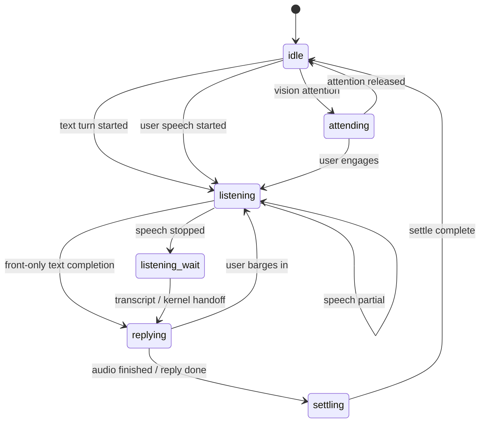

# Reactive Front Phase / Event Protocol 草案

这份文档定义 `Reactive Front Runtime` 的相位与事件协议。

它回答四个问题：

- front 现在到底围绕哪些 phase 运转
- 哪些 event 是稳定生产的
- front 收到 event 后应该产出什么
- 当前实现和目标协议之间还差哪几步

这一版刻意区分两层：

- 当前稳定实现
- 下一阶段推荐协议

避免把“已经落地的状态机”和“未来要补的能力”混在一起。

## 一句话结论

当前项目已经有一套可运行的 front lifecycle：

- `listening`
- `listening_wait`
- `replying`
- `settling`
- `idle`

同时还出现了两个更偏 front 语义的扩展态：

- `attending`
- `observing`

但这两个扩展态目前还没有完整落入身体执行层。

所以当前最稳的说法是：

- front phase vocabulary 已经比执行层更丰富
- embodiment stable phase set 还只有五个主相位

## 当前稳定相位

下面这些 phase 已经是当前 runtime 主链路里的稳定相位。

| Phase | 语义 | 当前状态 |
| --- | --- | --- |
| `listening` | 正在接收用户输入 | 已稳定 |
| `listening_wait` | 用户刚说完，等待最终文本或 handoff | 已稳定 |
| `replying` | 系统正在组织或播报回复 | 已稳定 |
| `settling` | 回复结束后的短暂收尾 | 已稳定 |
| `idle` | 当前无线程活跃，进入待机外显 | 已稳定 |

这些相位已经贯通：

- `RuntimeScheduler`
- `FrontService`
- `surface_state`
- `SurfaceDriver`
- `EmbodimentCoordinator`
- Web 模板显示

## 当前扩展相位

下面两个 phase 已经出现在 front 语义里，但还不是完整稳定的执行层 phase。

| Phase | 语义 | 当前状态 |
| --- | --- | --- |
| `attending` | 因视觉或注意力变化而进入关注态 | front 语义已存在，执行层未完全承接 |
| `observing` | 未命中显式映射时的默认观察态 | front 默认回退态，执行层未承接 |

当前 `FrontService` 已经会把 `vision_attention_updated` 映射为 `attending`。
但 `SurfaceDriver` 和 `EmbodimentCoordinator` 当前仍只接受五个稳定 phase。

也就是说：

- `attending` 现在更像 front-local phase
- 还不是 embodiment-stable phase

## 当前稳定事件源

下面这些 event 已经是当前系统里真正有生产路径的事件。

| Event | 生产者 | 典型目标 phase |
| --- | --- | --- |
| `turn_started` | `RuntimeScheduler.handle_user_text()` | `listening` |
| `listening_entered` | `RuntimeScheduler.handle_user_text()` | `listening` |
| `user_speech_started` | speech 输入链路 | `listening` |
| `user_speech_partial` | speech 输入链路 | `listening` |
| `user_speech_stopped` | speech 输入链路 | `listening_wait` |
| `kernel_output_ready` | kernel 结果交付阶段 | `replying` |
| `assistant_audio_started` | reply audio 回调 | `replying` |
| `assistant_audio_delta` | reply audio 回调 | `replying` |
| `assistant_audio_finished` | reply audio 回调 | `settling` |
| `settling_entered` | runtime 收尾阶段 | `settling` |
| `idle_entered` | runtime 收尾阶段 | `idle` |
| `idle_tick` | idle loop | `idle` |

## 当前预留但未完整生产的事件

下面这些 event 已经有消费面或测试面，但还不是稳定的端到端生产事件。

| Event | 当前状态 | 说明 |
| --- | --- | --- |
| `vision_attention_updated` | 消费面已存在 | front 能消费，但当前 repo 里还没有稳定生产源 |
| `turn_settling` | 语义预留 | 还不是主链路稳定事件 |

这意味着：

- front 已经为 reactive vision 预留了入口
- 但视觉事件总线本身还没补全

## 当前内部决策 Contract

front 在内部接收 event 后，当前会产出一个 `FrontDecision`。

核心字段已经很清晰：

- `signal_name`
- `thread_id`
- `turn_id`
- `reply_text`
- `lifecycle_state`
- `surface_patch`
- `tool_calls`
- `debug_reason`

这个 contract 很重要，因为它其实已经回答了前台真正该做什么：

1. 决定现在属于哪个 lifecycle state
2. 决定要不要给 surface/embodiment 一个 patch
3. 决定要不要立刻触发 front-owned tool calls
4. 决定是否需要一个对外可见的自然语言输出

这说明 front 不是单纯文本层，而是真正的 runtime reactor。

## 推荐的相位状态机

下面这张图描述的是推荐协议，同时尽量贴近当前实现。

## 当前已经实现的关键转移

### 1. 文本输入回合

当前文本输入大致是这样流转：

1. `turn_started`
2. `listening_entered`
3. front 先尝试快速处理
4. 不能直接完成时，交给 kernel
5. `kernel_output_ready`
6. `replying`
7. `settling_entered`
8. `idle_entered`
9. 后续进入 `idle_tick`

### 2. 语音输入回合

当前语音输入大致是这样流转：

1. `user_speech_started`
2. `user_speech_partial`
3. `user_speech_stopped`
4. phase 进入 `listening_wait`
5. 最终文本落地后，再进入文本回合或 kernel handoff

`listening_wait` 的存在很关键。
它把“用户说完”和“系统正式开答”之间的短空档变成了可见阶段。

### 3. reply audio 回合

当最终回复进入语音播报时：

1. `assistant_audio_started`
2. `assistant_audio_delta`
3. `assistant_audio_finished`

这些 event 会让 front 保持在 `replying`，直到播报结束后进入 `settling`。

## 当前已经成立的硬规则

### 1. 用户插话优先于旧回复

当前系统已经有一个很重要的抢占规则：

- 用户开始说话时，会主动中断当前 reply audio
- 同时重置 speech motion
- 被打断的旧 turn 不应该再回写 `settling / idle`

这条规则是 `Reactive Front Runtime` 成立的基础。

### 2. front tool calls 可以独立于文本输出存在

当前 front 在某些 event 下会只做动作，不一定给用户额外文本。

例如：

- `user_speech_started` 时停止外显动作
- `idle_tick` 时做 idle look-around
- `vision_attention_updated` 时触发 `move_head` 或 `head_tracking`

这说明 front 的本体是事件反应器，不是纯说话器。

### 3. 不是所有 front decision 都应该上浮给外部

当前 runtime 只会在两类情况下显式 surface front decision：

1. 有 `reply_text`
2. 某些特定 signal 带来 tool calls

当前默认被 surface 的 signal 只有：

- `idle_tick`
- `vision_attention_updated`

这也符合设计直觉：

- 不是每一次内部反应都需要变成外部可见事件

## 当前 surface 层的真实边界

这里有一个必须写清楚的现状：

- `FrontService` 已经会产出 `attending`
- 但 `SurfaceDriver` 目前仍只识别：
  - `idle`
  - `settling`
  - `listening_wait`
  - `replying`
  - `listening`

所以如果下一步要把 `attending` 变成正式 phase，不能只改 front。
必须同时更新：

- surface phase normalization
- embodiment coordinator normalization
- Web status 呈现

否则 `attending` 仍然只是 front-local 语义，而不是系统级 phase。

## 推荐的协议边界

推荐把 phase/event 协议分成三层。

### 1. Input Event Layer

只定义发生了什么：

- 用户开始说话
- 用户停止说话
- kernel 输出好了
- 视觉注意力变化了

### 2. Front Decision Layer

只定义 front 对这些事件作何反应：

- 当前 phase
- 是否打断
- 是否给 surface patch
- 是否执行 front tool
- 是否给出短语言输出

### 3. Embodiment Phase Layer

只定义执行层当前能稳定承接哪些 phase。

这三层拆开以后，系统会清楚很多：

- front 可以先扩展语义
- embodiment 可以按自己的节奏收敛稳定 phase 集

## 下一阶段推荐动作

如果沿着这个协议继续推进，最优先的不是增加更多 phase 名词，而是补三件事。

### 1. 补齐视觉事件生产面

把 `vision_attention_updated` 从“消费面预留”变成真正的生产事件。

### 2. 决定 `attending` 是否升级为系统级稳定相位

如果要升，就要一起改：

- `SurfaceDriver`
- `EmbodimentCoordinator`
- Web surface 显示

### 3. 统一 front event schema

推荐后续所有 front event 都至少带这些字段：

- `name`
- `thread_id`
- `turn_id`
- `user_text`
- `metadata`
- `source`
- `ts_monotonic`

当前已有 schema 已经很接近，只差更明确的来源和时间语义。

## 当前结论

当前项目已经拥有一个真实存在的 `Reactive Front Runtime` 生命周期协议。

它不是从零开始设计，而是已经在运行：

- speech lifecycle 已经成立
- text turn lifecycle 已经成立
- reply audio lifecycle 已经成立
- idle lifecycle 已经成立

现在真正要补的，不是“有没有 front”，而是：

- front phase 词表是否要继续提升为系统协议
- vision event 什么时候正式接入这套状态机
