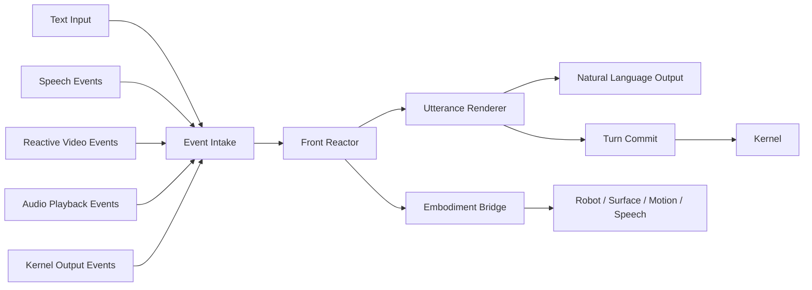

# Reactive Front Runtime 架构与施工文档

这份文档不是重新发明一套 front 概念。

它的目的只有一个：

- 把现有 front 草案收口成一份可以直接开工的施工文档

这份文档只讨论 `front`。
不重讲内核，不重造 control-plane，不把 front 重新说成另一个脑子。

---

## 1. 一句话架构

`Reactive Front Runtime` 是系统的实时交互壳。

它负责：

- 接住文本、语音、视频、播放状态、kernel 结果
- 立刻产出自然语言短反馈
- 立刻驱动机器人外显状态
- 维持交互节奏与中断体验
- 在每轮结束后，把压缩后的 `input + output` 提交给 kernel

它不负责：

- 判断是不是任务
- 判断要不要开 run
- 多任务调度
- 长链路规划

一句话收口：

- `front` 负责外显复杂性
- `kernel` 负责任务复杂性

---

## 2. 这份文档相对现有草案的唯一收敛

现有草案里提过 `Handoff Manager`。

按当前主线，这里收敛成更简单的一条：

- `front` 不判断“是否 handoff”
- `front` 每轮都提交给 `kernel`
- 提交内容只保留压缩后的 `input + output`

所以在施工层，`Handoff Manager` 改叫：

- `Turn Commit`

它不是任务分流器，只是轮次提交器。

---

## 3. 总体架构图

这张图要表达的只有三件事：

- 输入先进入 front
- front 先完成实时反应与外显
- 然后再把本轮压缩结果提交给 kernel

---

## 4. 组件拆分

当前 front 建议固定为 5 个部件。

### 4.1 Event Intake

负责接入事件，不负责长思考。

输入源包括：

- 用户文本
- 用户语音开始 / partial / 停止
- reply audio 开始 / delta / 结束
- idle tick
- reactive vision 事件
- kernel 输出事件

当前代码锚点：

- [scheduler.py](/Users/apple/work-py/reachy_mini/src/reachy_mini/runtime/scheduler.py)

### 4.2 Reactor

负责把事件变成 front 内部反应结果。

输出是：

- 当前 `lifecycle_state`
- 一个 `surface_patch`
- 可选 `tool_calls`
- 可选短 `reply_text`

当前代码锚点：

- [service.py](/Users/apple/work-py/reachy_mini/src/reachy_mini/front/service.py)
- [events.py](/Users/apple/work-py/reachy_mini/src/reachy_mini/front/events.py)

### 4.3 Embodiment Bridge

负责把 front 反应同步到身体层。

包括：

- phase 外显
- speech motion
- head tracking
- move_head / emotion / dance
- 显式动作与 tracking 的冲突处理

当前代码锚点：

- [coordinator.py](/Users/apple/work-py/reachy_mini/src/reachy_mini/runtime/embodiment/coordinator.py)
- [surface_driver.py](/Users/apple/work-py/reachy_mini/src/reachy_mini/runtime/surface_driver.py)

### 4.4 Utterance Renderer

负责把 front 当前反应转成自然语言。

职责只有：

- 怎么说
- 说多长
- 是否给短确认
- kernel 输出回来后怎么包装成自然输出

它不负责：

- 任务规划
- run 管理
- 工具编排

当前代码锚点：

- [service.py](/Users/apple/work-py/reachy_mini/src/reachy_mini/front/service.py)

### 4.5 Turn Commit

负责每轮把压缩后的结果提交给 kernel。

它只提交：

- `input`
- `output`

可带最小 envelope：

- `thread_id`
- `turn_id`

但不提交：

- 每次 phase 切换
- 每个语音 partial
- 每帧视觉变化
- 每个动作 patch
- front 内部瞬时状态

当前代码锚点：

- [scheduler.py](/Users/apple/work-py/reachy_mini/src/reachy_mini/runtime/scheduler.py)

---

## 5. 内部数据结构

front 内部现在已经有一套很合适的轻结构，不需要重新发明。

### 5.1 输入事件：`FrontSignal`

当前字段见 [events.py](/Users/apple/work-py/reachy_mini/src/reachy_mini/front/events.py)：

| 字段 | 含义 |
| --- | --- |
| `name` | 事件名 |
| `thread_id` | 线程标识 |
| `turn_id` | 回合标识 |
| `user_text` | 当前用户文本 |
| `metadata` | 小型附加信息 |

结论：

- `FrontSignal` 足够做 front 输入壳
- 热路径不要塞大对象
- `metadata` 保持扁平、小、稳定

### 5.2 反应结果：`FrontDecision`

当前字段见 [events.py](/Users/apple/work-py/reachy_mini/src/reachy_mini/front/events.py)：

| 字段 | 含义 |
| --- | --- |
| `signal_name` | 来源事件 |
| `thread_id` | 线程标识 |
| `turn_id` | 回合标识 |
| `reply_text` | 对外短输出 |
| `lifecycle_state` | front 当前相位 |
| `surface_patch` | 身体/外显 patch |
| `tool_calls` | front 自己拥有的即时工具调用 |
| `debug_reason` | 调试原因 |

结论：

- `FrontDecision` 就是 front 的内部标准结果
- 不需要再额外创造第二套协议

### 5.3 用户轮次快速结果：`FrontUserTurnResult`

当前字段见 [events.py](/Users/apple/work-py/reachy_mini/src/reachy_mini/front/events.py)：

| 字段 | 含义 |
| --- | --- |
| `reply_text` | front 本轮回复 |
| `tool_calls` | front 本轮工具调用 |
| `tool_results` | front 本轮工具结果 |
| `completes_turn` | front 是否已经完成本轮外显 |
| `debug_reason` | 调试原因 |

这里要注意：

- `completes_turn` 只表示 front 外显层本轮是否已闭合
- 它不代表 front 替 kernel 做任务判断

### 5.4 提交给 Kernel 的最小轮次包

当前主线下，提交给 kernel 的东西只保留：

| 字段 | 含义 |
| --- | --- |
| `thread_id` | 所属线程 |
| `turn_id` | 当前回合 |
| `input` | 用户实际输入 |
| `output` | front 实际输出 |

这条边界必须硬。

---

## 6. Phase 体系

front 当前 phase 分两层看。

### 6.1 当前稳定 phase

这 5 个 phase 已经是稳定主链：

| Phase | 说明 | 当前状态 |
| --- | --- | --- |
| `idle` | 待机 | 已稳定 |
| `listening` | 正在听用户 | 已稳定 |
| `listening_wait` | 用户刚说完、等待落文本或下一步 | 已稳定 |
| `replying` | 正在组织或播报回复 | 已稳定 |
| `settling` | 回复后的短收尾 | 已稳定 |

当前代码锚点：

- [surface_driver.py](/Users/apple/work-py/reachy_mini/src/reachy_mini/runtime/surface_driver.py)

### 6.2 当前扩展 phase

下面这些词里，`attending` 已经升级为系统级 stable phase。
`observing` 仍然只是 front-local 语义：

| Phase | 说明 | 当前状态 |
| --- | --- | --- |
| `attending` | 因视觉注意力进入关注态 | 已升级 |
| `observing` | 默认观察态回退 | front-local |

当前结论也很明确：

- `attending` 现在可以跨 front / surface / embodiment / UI 统一表达
- 行为上先保持最小承接，不在这一步重写身体语义
- `observing` 仍然不进入系统级 phase 集

参考：

- [reactive-front-phase-event-protocol.zh-CN.md](/Users/apple/work-py/reachy_mini/reactive-front-phase-event-protocol.zh-CN.md)
- [attending-phase-promotion.zh-CN.md](/Users/apple/work-py/reachy_mini/attending-phase-promotion.zh-CN.md)

---

## 7. 事件主线

### 7.1 文本主线

文本用户回合的标准流：

1. `turn_started`
2. `listening_entered`
3. front 给短反馈或直接进入呈现准备
4. 本轮外显完成
5. `Turn Commit` 提交本轮 `input + output`

### 7.2 语音主线

语音回合的标准流：

1. `user_speech_started`
2. `user_speech_partial`
3. `user_speech_stopped`
4. 进入 `listening_wait`
5. 形成最终用户输入后，再进入文本主线

### 7.3 播报主线

当系统进入回复播报：

1. `assistant_audio_started`
2. `assistant_audio_delta`
3. `assistant_audio_finished`
4. 进入 `settling`
5. 回到 `idle`

### 7.4 Reactive Vision 主线

当前建议不要推翻已有 tracking 热路径。

最短路径是：

1. 保留 `CameraWorker -> MovementManager`
2. 在旁边长一个轻量事件 emitter
3. 把事件投喂给 front
4. front 再决定是否需要更正式的 `attending` 表达

参考：

- [reactive-vision-lane-policy.zh-CN.md](/Users/apple/work-py/reachy_mini/reactive-vision-lane-policy.zh-CN.md)
- [reactive-vision-event-schema.zh-CN.md](/Users/apple/work-py/reachy_mini/reactive-vision-event-schema.zh-CN.md)

---

## 8. 视频在 front 里的位置

视频必须分两层。

### 8.1 Reactive Vision Lane

属于 front 热路径。

负责：

- 有无人
- 是否获得注意力
- 朝向变化
- 是否需要维持 presence
- 丢目标后平滑退场

当前代码锚点：

- [camera_worker.py](/Users/apple/work-py/reachy_mini/src/reachy_mini/runtime/camera_worker.py)
- [yolo_head_tracker.py](/Users/apple/work-py/reachy_mini/src/reachy_mini/runtime/vision/yolo_head_tracker.py)

### 8.2 Semantic Vision Lane

不属于 front 热路径。

负责：

- 图像问答
- 图像描述
- 场景理解
- 多步视觉推理

当前代码锚点：

- [processors.py](/Users/apple/work-py/reachy_mini/src/reachy_mini/runtime/vision/processors.py)
- [reachy_tools.py](/Users/apple/work-py/reachy_mini/src/reachy_mini/runtime/tools/reachy_tools.py)

一句话：

- reactive vision 负责先有反应
- semantic vision 负责真正看懂

---

## 9. 技术选型

front 当前最适合的技术路线如下。

### 9.1 Runtime 基础

- Python
- `asyncio`
- 常驻 runtime task
- 线程级输出订阅队列

原因：

- 现在项目已经是这条线
- 足够承载文本、语音、视频、播放事件
- 不需要为了 front 再引入一套 WebSocket-only runtime 内核

### 9.2 内部协议

- `dataclass`
- 小型扁平 `metadata`
- 不在热路径上做大 JSON 输出

原因：

- 热路径里大模型产重 JSON 会慢
- front 的外显本来就应该是自然语言，不是结构化暴露

### 9.3 语言层

- front 输出保持自然语言
- 热路径尽量模板化 / 轻渲染
- 需要更自然时再接轻量模型或现有 front model

原则：

- 决策先发生
- 语言后渲染

### 9.4 具身层

- `SurfaceDriver` 维护稳定 phase
- `EmbodimentCoordinator` 统一身体入口
- `SpeechDriver` 管 speech motion
- `MovementManager` 管动作落地

### 9.5 视频层

- YOLO head tracker 做 reactive vision
- `CameraWorker` 保留 30Hz 左右热路径
- 事件层只发离散变化，不把连续 tracking 数据直接灌进 front

---

## 10. 当前代码里的实际架构归位

这部分很重要，因为施工不能再停留在抽象词。

### 10.1 `RuntimeScheduler`

定位：

- front 的 runtime host
- event intake 主入口
- kernel 输出监听器
- front output 广播器
- turn commit 发起点

当前代码：

- [scheduler.py](/Users/apple/work-py/reachy_mini/src/reachy_mini/runtime/scheduler.py)

### 10.2 `FrontService`

定位：

- front 的 reactor
- front 的自然语言快速层
- front 信号消费器

当前代码：

- [service.py](/Users/apple/work-py/reachy_mini/src/reachy_mini/front/service.py)

### 10.3 `SurfaceDriver`

定位：

- 稳定 phase 归一化
- 多线程 surface state 聚合

当前代码：

- [surface_driver.py](/Users/apple/work-py/reachy_mini/src/reachy_mini/runtime/surface_driver.py)

### 10.4 `EmbodimentCoordinator`

定位：

- 统一控制 speech / motion / tracking 的具身桥
- 处理显式动作与 tracking 的冲突

当前代码：

- [coordinator.py](/Users/apple/work-py/reachy_mini/src/reachy_mini/runtime/embodiment/coordinator.py)

### 10.5 `CameraWorker + HeadTracker`

定位：

- reactive vision 驱动层

当前代码：

- [camera_worker.py](/Users/apple/work-py/reachy_mini/src/reachy_mini/runtime/camera_worker.py)
- [yolo_head_tracker.py](/Users/apple/work-py/reachy_mini/src/reachy_mini/runtime/vision/yolo_head_tracker.py)

结论：

- front 并不是从零开始
- 当前 repo 已经有一条真实 front 主干
- 施工的重点是收口和补桥，不是重写

---

## 11. 施工阶段

这里只给真正需要干的阶段，不再开虚任务。

### 阶段 1：收口现有 Front 主干

目标：

- 明确 `RuntimeScheduler` 是 front runtime host
- 明确 `FrontService` 是 front reactor
- 明确 `FrontSignal / FrontDecision / FrontUserTurnResult` 是内部标准结构
- 明确 kernel 边界只有 `input + output`

产物：

- 这份文档
- 现有 front 草案作为设计依据

验收：

- 不再把 front 说成任务分流器
- 不再让 front 持有一套任务控制面
- 不再把 front 内部事件全量灌给 kernel

### 阶段 2：补齐 Front 事件统一入口

目标：

- 把文本、语音、reply audio、idle tick、kernel output 统一看成 `FrontSignal` 来源
- 保持 `FrontDecision` 为单一反应输出

优先文件：

- [scheduler.py](/Users/apple/work-py/reachy_mini/src/reachy_mini/runtime/scheduler.py)
- [service.py](/Users/apple/work-py/reachy_mini/src/reachy_mini/front/service.py)
- [events.py](/Users/apple/work-py/reachy_mini/src/reachy_mini/front/events.py)

验收：

- 新事件接入时，不需要再造第二套 front 反应协议

### 阶段 3：补 Reactive Vision Event Emitter

目标：

- 不动现有 tracking 热路径
- 在旁边新增轻量 emitter
- 先只发少量离散事件

第一阶段事件建议：

- `person_detected`
- `person_lost`
- `attention_acquired`
- `attention_released`

优先文件：

- [camera_worker.py](/Users/apple/work-py/reachy_mini/src/reachy_mini/runtime/camera_worker.py)
- [yolo_head_tracker.py](/Users/apple/work-py/reachy_mini/src/reachy_mini/runtime/vision/yolo_head_tracker.py)

验收：

- front 开始拥有正式的视频热路径输入
- 但 tracking 实时性不下降

### 阶段 4：把 Vision Event 接进 Front

目标：

- 把 reactive vision 事件接到 `FrontSignal`
- 允许 front 产出更稳定的 `attending` 语义
- 暂时仍可保持 `attending` 为 front-local phase

验收：

- video 不再只是直接驱动动作
- front 开始真正“看见”视觉热路径事件

### 阶段 5：视情况升级 `attending`

前提：

- 视觉事件源稳定
- `attention_acquired / attention_released` 稳定生产
- UI 和身体层都愿意承接

再做：

- `SurfaceDriver`
- `EmbodimentCoordinator`
- UI/shell phase 展示

当前已完成最小升级版：

- `SurfaceDriver` 正式识别 `attending`
- `EmbodimentCoordinator` 正式识别 `attending`
- Web shell 状态文案已能直接显示 `attending`

这一步仍然保持“只认 phase，不重写大行为”。

---

## 12. 开工规则

后续实现 front 时，必须遵守下面 6 条。

### 规则 1

不要让 front 重新长成任务控制面。

### 规则 2

不要把 front 内部事件全量喂给 kernel。

### 规则 3

不要让热路径等待大模型输出复杂 JSON。

### 规则 4

不要为了“架构纯洁”打断今天已经能工作的 tracking 热路径。

### 规则 5

不要把 semantic vision 混进 reactive hot lane。

### 规则 6

优先补桥，不优先重写。

---

## 13. 时延目标

front 成立的前提是时延。

建议维持这些目标：

- `100ms` 内完成 phase 切换
- `300ms` 内给 first ack
- 用户插话时优先中断当前播报
- tracking 事件率显著低于 tracking 计算率

如果做不到这些目标，front 就会退化成“另一个慢 agent”。

---

## 14. 最终结论

当前项目的 `front` 架构应该固定成下面这句话：

`Reactive Front Runtime = Event Intake + Reactor + Embodiment Bridge + Utterance Renderer + Turn Commit`

再收一层就是：

- `front` 负责实时交互和外显复杂性
- `kernel` 只接轮次压缩后的 `input + output`

施工上最重要的不是重写 front，
而是：

- 承认当前已有主干
- 统一事件入口
- 保住热路径
- 把 reactive vision 正式长进 front
