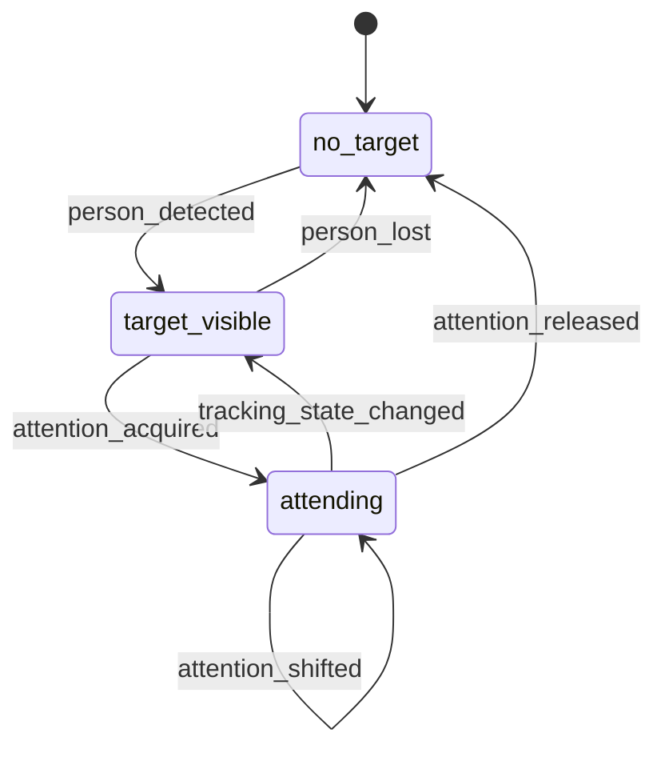

# Reactive Vision Event Schema 草案

这份文档定义 `Reactive Vision Lane` 进入 `Reactive Front Runtime` 时，建议采用的事件协议。

目标只有一个：

- 让视频热路径正式长进 front

但前提是不能为了“架构整齐”破坏现在已经能工作的低延迟追踪链路。

所以这一版坚持两个原则：

- 事件 schema 尽量贴近现有 `FrontSignal`
- 先定义最小可用事件集，不一次做复杂多目标协议

## 一句话结论

推荐 future reactive vision 统一发出：

- 一个共享的基础事件壳
- 四个第一阶段核心事件
- 少量稳定 metadata

第一阶段只需要这四个事件：

- `person_detected`
- `person_lost`
- `attention_acquired`
- `attention_released`

如果这四个跑稳了，再加：

- `attention_shifted`
- `tracking_state_changed`
- `engagement_changed`

## 为什么不直接复用 `vision_attention_updated`

`vision_attention_updated` 现在是一个很好用的消费面入口。

但它的问题是：

- 语义太宽
- 既像“目标位置变化”，又像“注意力状态变化”
- 还混着 tool decision 的使用期待

如果直接把所有视觉变化都塞进 `vision_attention_updated`，后面会很快变得模糊。

所以更稳的做法是：

1. 保留 `vision_attention_updated` 作为 front 消费兼容事件
2. 在视觉输入层先定义更清晰的原子事件
3. 需要兼容旧 front 时，再由 adapter 压缩成 `vision_attention_updated`

换句话说：

- sensor/schema 层尽量清楚
- front 兼容层可以保守

## 设计原则

### 1. 先事件，后动作

视觉输入层的职责是陈述“发生了什么”，不是直接替 front 选择动作。

所以 schema 不应该长成：

- `move_head_left_now`
- `stop_tracking_for_reply`

而应该长成：

- `attention_acquired`
- `tracking_state_changed`

### 2. 先单目标，后多目标

第一阶段 front 只需要一个 primary target。

不要一开始就设计：

- target graph
- target ranking arrays
- multi-person arbitration tree

那会让协议过早复杂化。

### 3. metadata 必须稳定、短小、可测试

热路径事件不能携带大对象，也不应该绑定图像本体。

应优先用：

- 布尔
- 小字符串
- 数值
- 小型扁平字典

## 推荐基础事件壳

建议 reactive vision 的事件壳直接沿用当前 `FrontSignal` 的风格。

推荐字段：

| 字段 | 类型 | 必填 | 说明 |
| --- | --- | --- | --- |
| `name` | `str` | 是 | 事件名 |
| `thread_id` | `str` | 是 | 归属线程 |
| `turn_id` | `str` | 否 | 当前相关 turn，没有可为空 |
| `user_text` | `str` | 否 | 通常为空，保留兼容 |
| `metadata` | `dict[str, Any]` | 是 | 稳定小字段集合 |
| `source` | `str` | 是 | 事件来源，如 `reactive_vision` |
| `ts_monotonic` | `float` | 是 | 单调时钟时间戳 |

如果要尽量少改现有 dataclass，第一阶段可以这么落地：

1. 继续使用现有 `FrontSignal`
2. 把 `source` 和 `ts_monotonic` 暂时放进 `metadata`
3. 等视觉事件流跑稳，再决定是否升级 `FrontSignal` 类型

这更符合 KISS。

## 第一阶段核心事件

### 1. `person_detected`

含义：

- 视野里首次出现一个可作为当前 primary target 的人

推荐 metadata：

| 字段 | 类型 | 必填 | 说明 |
| --- | --- | --- | --- |
| `source` | `str` | 是 | 固定为 `reactive_vision` |
| `target_id` | `str` | 是 | 当前目标标识，第一阶段可为稳定字符串 |
| `confidence` | `float` | 是 | 检测置信度 |
| `direction` | `str` | 否 | `left/right/up/down/front` |
| `tracking_enabled` | `bool` | 否 | 当前是否建议追踪 |
| `ts_monotonic` | `float` | 是 | 事件时间 |

### 2. `person_lost`

含义：

- 当前 primary target 持续丢失，已达到释放条件

推荐 metadata：

| 字段 | 类型 | 必填 | 说明 |
| --- | --- | --- | --- |
| `source` | `str` | 是 | 固定为 `reactive_vision` |
| `target_id` | `str` | 是 | 丢失的目标 |
| `lost_for_ms` | `float` | 是 | 已丢失时长 |
| `return_to_center` | `bool` | 否 | 是否建议回中 |
| `ts_monotonic` | `float` | 是 | 事件时间 |

### 3. `attention_acquired`

含义：

- front 应开始把注意力交给当前目标

它比 `person_detected` 更高一层。

`person_detected` 表示感知到了人。
`attention_acquired` 表示系统决定关注这个人。

推荐 metadata：

| 字段 | 类型 | 必填 | 说明 |
| --- | --- | --- | --- |
| `source` | `str` | 是 | 固定为 `reactive_vision` |
| `target_id` | `str` | 是 | 当前关注目标 |
| `direction` | `str` | 是 | `left/right/up/down/front` |
| `tracking_enabled` | `bool` | 否 | 是否建议开启 tracking |
| `engagement` | `str` | 否 | 如 `low/medium/high` |
| `ts_monotonic` | `float` | 是 | 事件时间 |

### 4. `attention_released`

含义：

- front 不再维持当前视觉注意力

推荐 metadata：

| 字段 | 类型 | 必填 | 说明 |
| --- | --- | --- | --- |
| `source` | `str` | 是 | 固定为 `reactive_vision` |
| `target_id` | `str` | 否 | 可为空，表示没有稳定目标 |
| `reason` | `str` | 是 | 如 `lost`, `disabled`, `overridden` |
| `return_to_center` | `bool` | 否 | 是否建议回中 |
| `ts_monotonic` | `float` | 是 | 事件时间 |

## 第二阶段扩展事件

如果第一阶段跑稳了，再补这三个事件就够了。

### 1. `attention_shifted`

含义：

- 注意力从旧目标切换到新目标

推荐 metadata：

- `from_target`
- `to_target`
- `direction`
- `ts_monotonic`

### 2. `tracking_state_changed`

含义：

- 跟踪状态发生变化

推荐 metadata：

- `tracking_enabled`
- `reason`
- `ts_monotonic`

### 3. `engagement_changed`

含义：

- 视觉在场感强度变化

推荐 metadata：

- `engagement`
- `target_id`
- `reason`
- `ts_monotonic`

## 与现有 front 兼容的 adapter

为了尽量少改现有 front，推荐加一层很薄的 adapter。

### 输入

- 原子视觉事件

### 输出

- 当前 front 已经认识的 `FrontSignal`

第一阶段兼容映射可以很简单：

| 新事件 | 兼容输出 |
| --- | --- |
| `attention_acquired` | `vision_attention_updated` |
| `attention_shifted` | `vision_attention_updated` |
| `tracking_state_changed` | `vision_attention_updated` |
| `attention_released` | 可先映射为 `vision_attention_updated`，metadata 带释放语义 |

而 `person_detected` / `person_lost` 第一阶段甚至可以先不直接投喂 front，
只用于 driver 内部状态机。

这能避免一上来就让 front 被低价值视觉事件淹没。

## 推荐 metadata 规范

### `direction`

第一阶段统一为：

- `left`
- `right`
- `up`
- `down`
- `front`

不要在 front 层直接传连续坐标。

连续坐标应该留在 sensor/driver 层内部使用。

### `target_id`

第一阶段不要求做真正全局稳定 re-identification。

只要满足：

- 在一个持续关注窗口里基本稳定
- 同一窗口内可对齐 `attention_acquired -> attention_released`

就够了。

### `engagement`

第一阶段推荐只用离散值：

- `low`
- `medium`
- `high`

不要把连续分数直接暴露给 front。

## 推荐生产约束

### 1. 事件必须降噪

不能每帧都发事件。

建议至少满足其中一种条件才发：

- 目标状态发生离散变化
- 方向区间发生变化
- 持续超过某个时间阈值

### 2. event rate 要低于 tracking rate

tracking 可以是 `30Hz`。

但 front 事件不应接近这个频率。

更合理的是：

- tracking 高频更新
- front event 低频离散变化

### 3. 释放事件必须明确原因

`attention_released` 或 `person_lost` 必须带 `reason`。

否则 front 很难区分：

- 目标真丢了
- 用户主动关掉 tracking
- 被显式动作抢占了

## 推荐状态压缩

最小状态机就够：

这里最重要的是：

- tracking state
- attention state

不要把更复杂的社交语义塞进热路径状态机。

## 当前实现到目标 schema 的最短路径

推荐分三步。

### 第一步

保持现有 `CameraWorker -> MovementManager` 不变。

### 第二步

在 `CameraWorker` 旁边增加一个轻量 emitter，
把 driver 内部状态压缩成上面的四个核心事件。

### 第三步

增加一个 adapter：

- 新视觉事件
- 转成 `FrontSignal(name=\"vision_attention_updated\", ...)`

等这条链路稳定后，再决定 front 是否直接消费新事件名。

## 当前结论

最合理的 reactive vision schema 不是一套很大的视觉协议，
而是一层非常薄的离散事件壳。

它只需要做到三件事：

1. 让视频热路径进入 front 视野
2. 不破坏现有低延迟 tracking
3. 为 `attending` 和 visual presence 提供正式输入源
